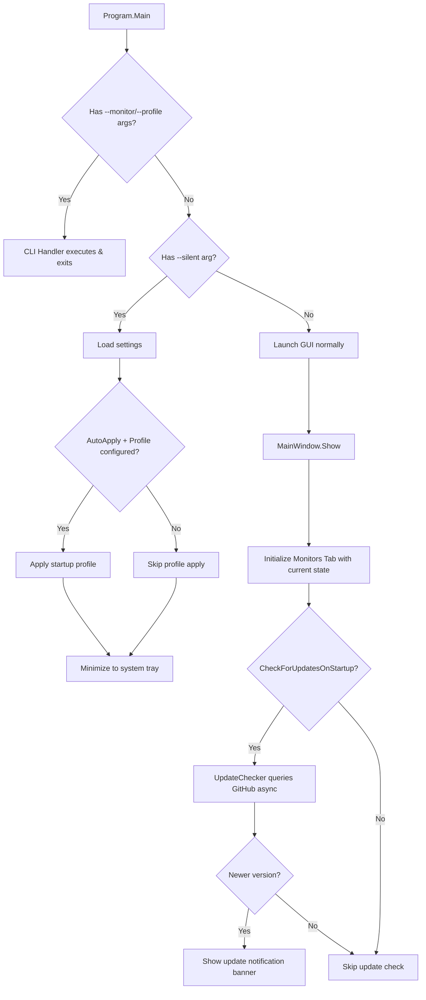

# Design Document: Enhancements v1.4

## Overview

This design covers six enhancements for Monitor Brightness Controller v1.4:

1. **Silent startup mode** — A `--silent` CLI argument that starts the application minimized to the system tray without displaying a window, intended for Windows auto-start scenarios.
2. **Startup registration includes `--silent`** — The "Start with Windows" registry entry automatically appends `--silent` so auto-start is always silent.
3. **Monitors tab initial state** — On first load in GUI mode, the Monitors tab shows current brightness/gamma values (from the applied startup profile or live DDC/CI reads).
4. **Help tab** — A new tab with scrollable, sectioned in-app documentation covering all application features.
5. **Auto-update notification** — On GUI launch, the app asynchronously checks GitHub releases for a newer version and displays a dismissible in-window notification with a link.
6. **Auto-update check setting** — A persisted boolean `CheckForUpdatesOnStartup` with a UI checkbox in Settings, defaulting to `true`.

All enhancements fit within the existing layered architecture (Application, Infrastructure, Interfaces, Models, Presentation) and extend existing components rather than introducing new architectural patterns.

## Architecture

```mermaid
graph TD
    subgraph Presentation
        MW[MainWindow]
        VM[MainWindowViewModel]
        HT[HelpTab UserControl]
        UN[UpdateNotification Banner]
    end

    subgraph Application
        CLI[CliHandler]
        MS[MonitorService]
        PM[ProfileManager]
        UC[UpdateChecker]
    end

    subgraph Infrastructure
        SR[StartupRegistration]
        SS[SettingsStore]
        GH[GitHubReleaseClient]
    end

    subgraph Models
        AS[AppSettings]
        PA[ParsedCliArguments]
    end

    subgraph External
        REG[(Windows Registry)]
        DDC[(DDC/CI Monitors)]
        NET[(GitHub API)]
    end

    MW --> VM
    MW --> HT
    MW --> UN
    VM --> MS
    VM --> PM
    VM --> UC
    VM --> SS
    CLI --> MS
    CLI --> PM
    SR --> REG
    MS --> DDC
    UC --> GH
    GH --> NET
    SS --> AS
    CLI --> PA
    Program --> CLI
    Program --> MW
    Program --> SR
end
```

### Startup Flow (Modified)



## Components and Interfaces

### 1. CliHandler Modifications (Silent Mode Parsing)

**Change**: Extend `ParsedCliArguments` with a `Silent` boolean flag. Extend `ParseArguments` to recognize `--silent` as a valid argument that can coexist with other arguments or stand alone.

**Rationale**: The `--silent` flag is orthogonal to `--monitor`/`--profile` — it controls window visibility, not brightness operations. The parser treats it as a modifier flag rather than a command.

```csharp
public sealed record ParsedCliArguments
{
    // ... existing properties ...
    public bool Silent { get; init; }
}
```

`ParseArguments` will consume `--silent` at any position, set the flag, and continue parsing remaining arguments. When `--silent` is the only argument, the result is a valid parse with no commands and no profile (triggering GUI-silent mode in Program.Main).

### 2. Program.Main Modifications (Silent Dispatch)

**Change**: After determining the invocation is not a pure CLI execution, check for `--silent`. If present:
- Load settings, optionally apply the startup profile
- Create the WPF `App` and `MainWindow` but do not call `window.Show()`
- Initialize the system tray immediately
- If combined with `--monitor`/`--profile`, execute those commands first, then enter silent mode

**Design Decision**: Silent mode still creates the MainWindow (hidden) so that double-clicking the tray icon can show it instantly. The window's `Visibility` starts as `Collapsed`.

### 3. StartupRegistration Modifications

**Change**: Modify `SetStartWithWindows(true)` to write `"<exe_path>" --silent` instead of `"<exe_path>"`. Modify `EnsureRegistration` to validate the value includes `--silent`.

```csharp
// In SetStartWithWindows when enable=true:
runKey.SetValue(AppName, $"\"{exePath}\" --silent");

// In EnsureRegistration:
var expectedValue = $"\"{currentExePath}\" --silent";
if (!string.Equals(existingValue, expectedValue, StringComparison.OrdinalIgnoreCase))
{
    runKey.SetValue(AppName, expectedValue);
}
```

### 4. MainWindowViewModel Modifications (Initial Monitor State)

**Change**: Extend the `Load()` method to populate monitor slider values on first load. The logic:
1. If a startup profile was applied (AutoApply=true, profile exists), use the profile's values for matched monitors and DDC/CI reads for unmatched monitors.
2. Otherwise, read live brightness/gamma from each monitor via `MonitorService.DetectMonitors()` (which already populates `CurrentBrightness`/`CurrentGamma` on `MonitorState`).

The existing `DetectMonitors()` already reads current values via DDC/CI. The ViewModel's `Load()` already calls this. The enhancement ensures that the `MonitorControlGroup` sliders are initialized from these values rather than from a default of 0.

### 5. IUpdateChecker / UpdateChecker (New Component)

**Interface** (in `Interfaces/`):

```csharp
public interface IUpdateChecker
{
    Task<UpdateCheckResult> CheckForUpdateAsync(CancellationToken cancellationToken = default);
}
```

**Model** (in `Models/`):

```csharp
public record UpdateCheckResult(bool IsUpdateAvailable, string? LatestVersion, string? ReleaseUrl);
```

**Implementation** (in `Application/`):

```csharp
public sealed class UpdateChecker : IUpdateChecker
{
    private static readonly TimeSpan Timeout = TimeSpan.FromSeconds(10);
    private readonly HttpClient _httpClient;
    private readonly Version _currentVersion;

    public UpdateChecker(HttpClient httpClient, Version currentVersion) { ... }

    public async Task<UpdateCheckResult> CheckForUpdateAsync(CancellationToken ct)
    {
        // GET https://api.github.com/repos/dlightman/monitor-brightness-controller/releases/latest
        // Parse tag_name (strip leading 'v'), compare semver (major.minor.patch only)
        // Return result; on any exception return IsUpdateAvailable=false
    }
}
```

**Design Decisions**:
- Uses the GitHub REST API (`/repos/{owner}/{repo}/releases/latest`) which returns JSON with `tag_name` and `html_url`.
- `HttpClient` is injected for testability — the real instance uses a 10-second timeout.
- Version comparison uses `System.Version` after stripping any leading 'v' and pre-release suffixes.
- One check per launch, triggered from `MainWindowViewModel.Load()` after UI initialization.

### 6. GitHubReleaseClient (New Infrastructure Component)

**Location**: `Infrastructure/GitHubReleaseClient.cs`

A thin HTTP wrapper that performs the actual GitHub API call and deserializes the response. Separated from `UpdateChecker` so the checker can be tested with a mock client.

```csharp
public interface IGitHubReleaseClient
{
    Task<GitHubRelease?> GetLatestReleaseAsync(CancellationToken ct);
}

public record GitHubRelease(string TagName, string HtmlUrl);
```

### 7. Help Tab (New Presentation Component)

**Location**: `Presentation/HelpTab.xaml` + `Presentation/HelpTab.xaml.cs`

A `UserControl` containing a `ScrollViewer` wrapping a `StackPanel` of documentation sections. Each section has:
- A `TextBlock` heading (bold, larger font)
- A `TextBlock` body with `TextWrapping="Wrap"`

Sections covered: Monitor Brightness & Gamma Control, Profiles, Smooth Transitions, System Tray Behavior, Startup Settings, CLI Usage, Silent Startup Mode, Auto-Update Notifications, Shortcut Creation, Proper Install.

The tab is inserted in `MainWindow.xaml` after Settings and before About:

```xml
<TabItem Header="Help">
    <p:HelpTab />
</TabItem>
```

### 8. Update Notification Banner (Presentation)

A `Border` element at the top of the main `Grid` (above the TabControl), similar to the existing startup notice pattern. Binds to ViewModel properties:
- `IsUpdateAvailable` (visibility)
- `LatestVersionText` (display string)
- `UpdateReleaseUrl` (hyperlink target)
- `DismissUpdateCommand` (close button)

### 9. AppSettings Extension

```csharp
public record AppSettings
{
    // ... existing properties ...

    /// <summary>When true, the app checks GitHub for updates on GUI startup.</summary>
    public bool CheckForUpdatesOnStartup { get; init; } = true;
}
```

The `= true` default handles both new installations (no file) and upgrades (missing property deserialized as default).

## Data Models

### ParsedCliArguments (Extended)

| Property | Type | Description |
|----------|------|-------------|
| MonitorCommands | `IReadOnlyList<MonitorCommand>` | Existing |
| ProfileName | `string?` | Existing |
| **Silent** | `bool` | New: true when `--silent` is present |
| ParseError | `string?` | Existing |
| ShowUsage | `bool` | Existing |

### AppSettings (Extended)

| Property | Type | Default | Description |
|----------|------|---------|-------------|
| CheckForUpdatesOnStartup | `bool` | `true` | Whether to check GitHub for updates on GUI startup |

### UpdateCheckResult (New)

| Property | Type | Description |
|----------|------|-------------|
| IsUpdateAvailable | `bool` | Whether a newer version exists |
| LatestVersion | `string?` | The version string (e.g., "1.5.0") |
| ReleaseUrl | `string?` | URL to the GitHub release page |

### GitHubRelease (New)

| Property | Type | Description |
|----------|------|-------------|
| TagName | `string` | The release tag (e.g., "v1.5.0") |
| HtmlUrl | `string` | URL to the release page |


## Correctness Properties

*A property is a characteristic or behavior that should hold true across all valid executions of a system — essentially, a formal statement about what the system should do. Properties serve as the bridge between human-readable specifications and machine-verifiable correctness guarantees.*

### Property 1: Silent flag parsing preserves coexisting arguments

*For any* valid combination of CLI arguments (zero or more `--monitor` groups, an optional `--profile`, and the `--silent` flag in any position), `ParseArguments` shall produce a result where `Silent == true` AND all other commands/profile are parsed identically to the same arguments without `--silent`.

**Validates: Requirements 1.7**

### Property 2: Startup registration value format

*For any* valid Windows executable path, calling `SetStartWithWindows(true)` shall produce a registry value exactly equal to the quoted path followed by a space and the literal string `--silent` (i.e., `"<path>" --silent`).

**Validates: Requirements 2.1**

### Property 3: EnsureRegistration corrects mismatched values

*For any* current executable path and any existing registry value that does not equal `"<current_exe_path>" --silent` (case-insensitive), calling `EnsureRegistration(true)` shall overwrite the registry value with the correct format `"<current_exe_path>" --silent`.

**Validates: Requirements 2.3**

### Property 4: Monitor initial state resolution

*For any* applied startup profile (with brightness and gamma maps) and any set of connected monitors, the resolved display value for each monitor shall equal the profile's value when the monitor's device path is present in the profile map, or the monitor's live DDC/CI-read value when the device path is absent from the profile map.

**Validates: Requirements 3.1, 3.6**

### Property 5: Semantic version comparison

*For any* two version strings in `major.minor.patch` format (with optional pre-release suffixes like `-beta.1`), the update checker's comparison shall determine ordering based solely on the numeric `major.minor.patch` components, ignoring pre-release suffixes, such that a higher major, minor, or patch value is always considered newer.

**Validates: Requirements 5.2, 5.6**

### Property 6: AppSettings CheckForUpdatesOnStartup round-trip

*For any* `AppSettings` instance with `CheckForUpdatesOnStartup` set to either `true` or `false`, serializing to JSON and deserializing back shall produce an `AppSettings` with the same `CheckForUpdatesOnStartup` value.

**Validates: Requirements 6.1**

## Error Handling

### Silent Mode Errors

| Scenario | Behavior |
|----------|----------|
| `--silent` + profile auto-apply fails (missing/invalid profile) | Remain in tray, log error to startup notice (visible when user opens window) |
| `--silent` + DDC/CI communication failure | Remain in tray, monitors show error state when window is eventually opened |

### Startup Registration Errors

| Scenario | Behavior |
|----------|----------|
| Registry key cannot be opened/written | Return `Result<Unit>.Failure(...)` — caller shows error in UI |
| `Environment.ProcessPath` is null | Return `Result<Unit>.Failure(...)` — defensive guard |

### Update Check Errors

| Scenario | Behavior |
|----------|----------|
| Network unreachable / DNS failure | Catch exception, return `IsUpdateAvailable = false`, log trace warning |
| HTTP timeout (>10 seconds) | `HttpClient.Timeout = 10s` causes `TaskCanceledException`, handled same as network error |
| Invalid JSON response from GitHub | Catch `JsonException`, return `IsUpdateAvailable = false` |
| Cannot parse version from tag_name | Return `IsUpdateAvailable = false` |

### Monitor State Errors

| Scenario | Behavior |
|----------|----------|
| DDC/CI read fails for a monitor | `MonitorState.CurrentBrightness` / `CurrentGamma` remain `null`, UI shows error indicator |
| Profile references a device path not found in connected monitors | Skip that entry, display live values for connected monitors |

## Testing Strategy

### Property-Based Tests (FsCheck.Xunit)

The project already uses **FsCheck.Xunit** (v2.16.6) for property-based testing. Each correctness property above will be implemented as a single `[Property]`-attributed test method with a minimum of 100 iterations.

**Tag format**: `// Feature: enhancements-v1-4, Property {N}: {title}`

| Property | Test Class | Strategy |
|----------|-----------|----------|
| 1: Silent flag parsing | `CliParserSilentPropertyTests` | Generate random valid arg arrays with `--silent` inserted at random positions; verify Silent=true and other fields match non-silent parse |
| 2: Registration format | `StartupRegistrationPropertyTests` | Generate random valid Windows paths; verify registry value matches expected format |
| 3: EnsureRegistration | `StartupRegistrationPropertyTests` | Generate random paths + random existing values that don't match; verify correction |
| 4: Monitor state resolution | `MonitorInitStatePropertyTests` | Generate random profiles and monitor lists; verify resolution logic |
| 5: Version comparison | `VersionComparisonPropertyTests` | Generate random semver triples + optional pre-release suffixes; verify comparison ordering |
| 6: Settings round-trip | `SettingsRoundTripPropertyTests` | Generate random AppSettings; verify JSON round-trip preserves CheckForUpdatesOnStartup |

### Unit Tests (xunit + FluentAssertions + NSubstitute)

| Area | Tests |
|------|-------|
| CliHandler.ParseArguments | `--silent` alone → valid; `--silent` with unknown args → error; `--silent` position invariance |
| StartupRegistration | Disable removes entry; disable when not present succeeds; registry inaccessible returns failure |
| UpdateChecker | Network failure → graceful; timeout → graceful; valid response with newer version → IsUpdateAvailable; same/older version → not available; single query enforcement |
| MainWindowViewModel.Load | No profiles → live values; AutoApply=false → live values; DDC/CI failure → error state |
| AppSettings deserialization | Missing `CheckForUpdatesOnStartup` property → defaults to true |
| Help tab content | All 10 required feature sections present |

### Integration Tests

| Area | Tests |
|------|-------|
| Silent mode startup | Process launches with `--silent`, no visible window, tray icon present |
| Update notification display | Mock HTTP returning newer version, verify banner appears in UI |

### Configuration

- Property tests: minimum 100 iterations (FsCheck default is 100)
- Each property test tagged with design document reference
- NSubstitute for mocking `IRegistryKeyWrapper`, `IMonitorService`, `IGitHubReleaseClient`
- No real network calls in unit/property tests — mock `HttpClient` via `HttpMessageHandler`
