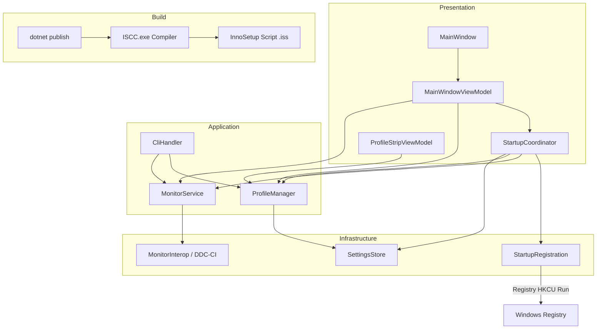

# Design Document: enhancements-v1-5

## Overview

This design covers the three-wave enhancement for Monitor Brightness Controller v1.5:

1. **Wave 1 — Bug Fixes**: Corrects startup behavior so manual launches display live hardware values without applying profiles, silent launches apply the configured startup profile, registry management for "Start with Windows" is reliable, and profile dropdown selection previews values without hardware commands.

2. **Wave 2 — Inno Setup Installer**: Introduces a proper Windows installer (.exe) built with Inno Setup that handles installation, upgrades, shortcuts, "Start with Windows" registry integration, and uninstall.

3. **Wave 3 — Build Pipeline & Documentation**: Integrates the Inno Setup compilation into the existing publish workflow, updates versioning to 1.5.0, and refreshes documentation (README, CHANGELOG, in-app Help).

### Design Decisions

| Decision | Rationale |
|----------|-----------|
| Refactor `Program.Main` startup logic to use `StartupCoordinator.Decide` for both GUI and silent modes | Centralizes the decision into a pure, testable function that already exists; avoids duplicating startup resolution logic |
| Profile dropdown selection triggers `PreviewProfile` (UI-only) with an explicit "Apply" button for hardware commands | Prevents accidental hardware changes; aligns with existing `PreviewProfile` / `RestoreHardwareValues` methods in MainWindowViewModel |
| Inno Setup `.iss` script at repository root | Simple discovery, single-file configuration, referenced directly by the build pipeline |
| Single distribution artifact (installer only) | Removes ambiguity about which binary to use; `builds/` folder contains only the versioned installer |
| FsCheck (already in use) for property-based testing | The test project already references `FsCheck.Xunit 2.16.6`; no new dependency needed |

## Architecture

The existing layered architecture is preserved. Changes are localized to specific components:



### Wave 1 Changes

- **`Program.Main`**: Distinguish manual vs silent launch, skip auto-apply on manual launch, ensure CLI override flag is passed through.
- **`StartupCoordinator`**: Already handles the `Decide` logic; the `Run` method in silent mode applies the startup profile. For manual launch, `Run` is either not called or called with auto-apply disabled.
- **`MainWindowViewModel`**: On manual launch → call `DetectMonitors()` and populate sliders from hardware values. Profile dropdown starts with no selection. `PreviewProfile` already loads sliders without hardware commands.
- **`ProfileStripViewModel`**: Selection change → calls `PreviewProfile`. "Apply" button → calls `ProfileManager.ApplyProfile`.
- **`StartupRegistration`**: Existing `SetStartWithWindows` and `EnsureRegistration` cover Requirements 3 and 7. Add logic to detect external registry entry and sync `StartWithWindows` in SettingsStore on startup.

### Wave 2 Changes

- **New file**: `MonitorBrightnessControllerSetup.iss` at repo root.
- Inno Setup script defines: AppId (consistent GUID), install dir, shortcuts (Start Menu, Desktop), "Start with Windows" checkbox, uninstaller registration, CloseApplications support, and settings preservation.
- The installer ships the framework-dependent single-file publish output (win-x64, `SelfContained=false`).

### Wave 3 Changes

- **Build pipeline**: After `dotnet publish`, invoke `ISCC.exe MonitorBrightnessControllerSetup.iss` with version passed via `/D` define. Output goes to `builds/v{VERSION}/`.
- **Documentation**: Update CHANGELOG, README Installation section, in-app Help tab.
- **Versioning**: Bump `.csproj` to `1.5.0` / `1.5.0.0`.

## Components and Interfaces

### Modified Components

#### StartupCoordinator (Presentation)

**Current behavior**: Pure `Decide` function + `Run` method that applies startup profile.

**Changes for v1.5**:
- `Decide` already distinguishes `AutoApplyDisabled`, `ApplyLastProfile`, `ApplyDefaultProfile`, `DefaultProfileMissing`, `CliOverride`. No logic change needed — the bug fix is in *where* `Run` is called.
- For **manual launch** (GUI mode in `Program.Main`): the MainWindow startup path must NOT call `StartupCoordinator.Run()` with auto-apply. Instead, it reads hardware values directly.
- For **silent launch**: `Program.RunSilentMode` already calls `ProfileManager.ApplyProfile`. The fix ensures `DefaultStartupProfileName` is checked first, then falls back to `LastAppliedProfileName`, and handles a missing profile by resetting the setting (Requirement 2.8).

#### MainWindowViewModel (Presentation)

**Changes for v1.5**:
- `Load()` on manual launch: calls `DetectMonitors()`, populates sliders from `CurrentBrightness` / `CurrentGamma`. Sets profile dropdown to null (no selection).
- On DDC/CI read failure for a monitor: set slider to 50, display "unknown", disable slider, show error indicator.
- Profile dropdown `SelectionChanged` → `PreviewProfile(name)` (already implemented).
- "Apply" button → `ProfileManager.ApplyProfile(name, monitorService)`.
- Deselect profile → `RestoreHardwareValues()` (already implemented).

#### StartupRegistration (Infrastructure)

**Changes for v1.5**:
- On app startup, if registry entry exists but `StartWithWindows` is false in SettingsStore → set to true and persist (sync external installer-created entry).
- `SetStartWithWindows(enable)`: overwrite existing entry if path differs (Requirement 3.7).
- `SetStartWithWindows(false)`: tolerant of missing entry (already uses `throwOnMissingValue: false`).

#### Program.Main

**Changes for v1.5**:
- Manual launch (no `--silent`, no CLI commands): create MainWindow, call `Load()` which reads hardware values only. Do NOT invoke `StartupCoordinator.Run()`.
- Silent launch with `--monitor`/`--profile` flags (Requirement 2.9): skip auto-apply, execute CLI commands only.

### New Components

#### MonitorBrightnessControllerSetup.iss (Build)

Inno Setup script defining the installer. Key sections:
- `[Setup]`: AppId GUID, AppName, AppVersion (from define), DefaultDirName, OutputDir, OutputBaseFilename, UninstallDisplayName.
- `[Files]`: Published single-file exe.
- `[Icons]`: Start Menu and Desktop shortcuts (conditional).
- `[Tasks]`: Checkboxes for shortcuts and "Start with Windows".
- `[Run]`/`[UninstallRun]`: Registry entry management for auto-start.
- `[Code]`: Pascal Script for CloseApplications (5s timeout), upgrade detection, preserve settings.json.

## Data Models

### Existing Models (unchanged)

| Model | Purpose |
|-------|---------|
| `AppSettings` | Persisted settings including `AutoApplyOnStartup`, `DefaultStartupProfileName`, `LastAppliedProfileName`, `StartWithWindows` |
| `Profile` | Named brightness/gamma map keyed by monitor device path |
| `MonitorState` | Runtime monitor state (index, name, device path, brightness, gamma, controllability) |
| `Result<T>` | Discriminated success/failure result type |
| `ParsedCliArguments` | Structured CLI parse output |

### Installer Data Model

The Inno Setup script uses the following compile-time defines:

| Define | Source | Example |
|--------|--------|---------|
| `MyAppVersion` | Passed via `/DMyAppVersion=1.5.0` from build pipeline, sourced from .csproj `Version` | `1.5.0` |
| `MyAppExeName` | Hardcoded in .iss | `MonitorBrightnessController.exe` |
| `MyAppId` | Stable GUID across versions | `{A1B2C3D4-...}` |

### Registry Entry Format

```
Key:   HKCU\SOFTWARE\Microsoft\Windows\CurrentVersion\Run
Name:  MonitorBrightnessController
Value: "<exePath>" --silent
```

Both the installer and the application use this identical format, ensuring interoperability (Requirement 7.1).


## Correctness Properties

*A property is a characteristic or behavior that should hold true across all valid executions of a system—essentially, a formal statement about what the system should do. Properties serve as the bridge between human-readable specifications and machine-verifiable correctness guarantees.*

### Property 1: Manual launch performs no hardware writes

*For any* set of detected monitors and *for any* AppSettings configuration (regardless of AutoApplyOnStartup, DefaultStartupProfileName, or LastAppliedProfileName values), when the application performs a manual launch (no `--silent` flag), no `SetBrightness` or `SetGamma` commands shall be sent to the MonitorService.

**Validates: Requirements 1.2, 1.3**

### Property 2: Startup decision prioritizes DefaultStartupProfileName

*For any* AppSettings with `AutoApplyOnStartup=true` and a non-null, non-empty `DefaultStartupProfileName` that exists in the provided profile name list, `StartupCoordinator.Decide` shall return `StartupAction.ApplyDefaultProfile` with that profile name.

**Validates: Requirements 2.2**

### Property 3: Startup decision falls back to LastAppliedProfileName

*For any* AppSettings with `AutoApplyOnStartup=true`, `DefaultStartupProfileName` null or empty, and a non-null, non-empty `LastAppliedProfileName` that exists in the provided profile name list, `StartupCoordinator.Decide` shall return `StartupAction.ApplyLastProfile` with that profile name.

**Validates: Requirements 2.3**

### Property 4: Startup decision skips apply when disabled or unresolvable

*For any* AppSettings where `AutoApplyOnStartup=false`, OR where `AutoApplyOnStartup=true` but both `DefaultStartupProfileName` and `LastAppliedProfileName` are null or empty, `StartupCoordinator.Decide` shall return `StartupAction.AutoApplyDisabled` with no error notice.

**Validates: Requirements 2.4, 2.5**

### Property 5: Startup decision detects missing default profile

*For any* AppSettings with `AutoApplyOnStartup=true` and a non-null, non-empty `DefaultStartupProfileName` that does NOT exist in the provided profile name list, `StartupCoordinator.Decide` shall return `StartupAction.DefaultProfileMissing` with a non-null notice.

**Validates: Requirements 2.8**

### Property 6: CLI override always skips startup apply

*For any* AppSettings and *for any* profile name list, when `isCliOverride=true`, `StartupCoordinator.Decide` shall return `StartupAction.CliOverride` regardless of other settings.

**Validates: Requirements 2.9**

### Property 7: Profile preview loads values without hardware commands

*For any* valid profile containing brightness and gamma maps, and *for any* set of connected monitors (with matching device paths), calling `PreviewProfile` shall update the ViewModel's brightness/gamma slider values for mapped monitors without invoking any `SetBrightness` or `SetGamma` calls on the MonitorService.

**Validates: Requirements 4.1, 4.2**

### Property 8: Legacy profile preview preserves gamma sliders

*For any* profile with a null `MonitorGammaMap` (legacy profile) and *for any* initial gamma slider values on the ViewModel's monitors, calling `PreviewProfile` shall leave all gamma slider values unchanged from their initial state.

**Validates: Requirements 4.3**

### Property 9: Profile deselect restores hardware values

*For any* set of monitors with known hardware-reported brightness and gamma values, after previewing any profile (which may change slider values), deselecting the profile (calling `RestoreHardwareValues`) shall restore each monitor's brightness and gamma sliders to the hardware-reported values returned by `GetBrightness` and `GetGamma`.

**Validates: Requirements 4.5**

## Error Handling

### Wave 1: Application Error Handling

| Scenario | Behavior |
|----------|----------|
| DDC/CI read failure on manual launch | Default slider to 50, display "unknown", disable slider controls, show error indicator on monitor panel (Req 1.5) |
| Profile_Apply failure during silent launch | Log via Trace, store user-facing notice for display when window is next shown, remain running in system tray (Req 2.6) |
| DefaultStartupProfileName references deleted profile | Reset to null, persist change, do not apply (Req 2.8) |
| Registry write failure on "Start with Windows" enable | Display error message to user, do NOT revert the SettingsStore value (Req 3.6) |
| Registry entry missing on "Start with Windows" disable | Complete successfully without error (Req 3.3) |
| Hardware read failure on profile deselect | Leave affected sliders at last displayed position, show error message indicating which monitors failed (Req 4.6) |

### Wave 2: Installer Error Handling

| Scenario | Behavior |
|----------|----------|
| Running application during upgrade | Send termination request, wait 5 seconds, prompt user to close manually if still running (Req 6.5, 6.6) |
| Installation directory not writable | Inno Setup built-in error handling displays OS permission error |
| Registry write failure during install | Inno Setup built-in error handling; checkbox state may not persist |

### Wave 3: Build Error Handling

| Scenario | Behavior |
|----------|----------|
| ISCC.exe not found in build environment | Build fails with clear error message (Req 9.5) |
| Installer compilation fails | Build fails with Inno Setup error output (Req 9.5) |
| Version mismatch between .csproj and .iss | Prevented by design — .iss reads version from `/D` define sourced from .csproj (Req 9.4) |

## Testing Strategy

### Property-Based Tests (FsCheck + xUnit)

The project already uses **FsCheck.Xunit 2.16.6** for property-based testing. All new property tests will follow the same pattern.

**Configuration**: Minimum 100 iterations per property test (FsCheck default is 100).

**Properties to implement** (referencing the Correctness Properties section above):

| Property | Test Class | What is generated |
|----------|-----------|-------------------|
| Property 1 | `ManualLaunchNoHardwareWritesTests` | Random AppSettings, random monitor lists |
| Property 2 | `StartupDecisionTests` | Random settings with existing default profile name |
| Property 3 | `StartupDecisionTests` | Random settings with existing last-applied profile |
| Property 4 | `StartupDecisionTests` | Random settings with auto-apply disabled or empty names |
| Property 5 | `StartupDecisionTests` | Random settings with non-existent default profile name |
| Property 6 | `StartupDecisionTests` | Random settings with isCliOverride=true |
| Property 7 | `ProfilePreviewNoHardwareTests` | Random profiles with valid maps, random monitors |
| Property 8 | `LegacyProfileGammaPreservationTests` | Random legacy profiles, random initial gamma values |
| Property 9 | `ProfileDeselectRestoresHardwareTests` | Random monitors with hardware values, random profiles |

**Tag format**: `// Feature: enhancements-v1-5, Property {N}: {title}`

### Unit Tests (xUnit + FluentAssertions + NSubstitute)

Example-based tests for specific scenarios:

- Manual launch with DDC/CI failure → slider defaults, disabled state
- Profile dropdown with no selection on manual launch
- "Apply" button triggers `ProfileManager.ApplyProfile`
- Registry sync on startup (external entry detection)
- Registry failure error messaging
- Silent launch timing (integration)

### Integration Tests

- Full startup flow: manual launch end-to-end with mocked hardware
- Full startup flow: silent launch end-to-end with mocked hardware
- Registry read/write with mocked `IRegistryKeyWrapper`
- Installer artifact verification (post-build check that installer exists and has correct name)

### Manual/Smoke Tests

- Installer: fresh install, upgrade, uninstall scenarios
- Installer: shortcut creation, "Start with Windows" checkbox
- Installer: settings.json preservation across upgrades
- Build pipeline: ISCC.exe invocation produces correct output
- Documentation: CHANGELOG, README, Help tab content review
