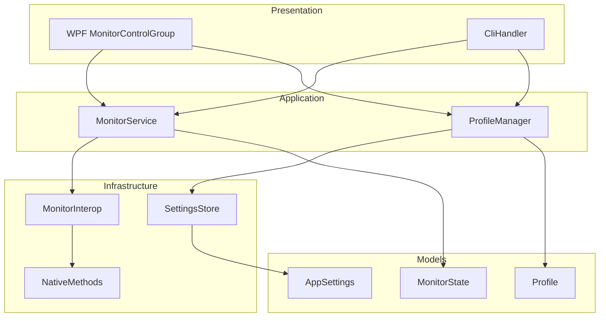

# Design Document: Gamma Control

## Overview

This design extends the Monitor Brightness Controller to support per-monitor gamma control via DDC/CI VCP code 0x12 (Video Gain). The implementation mirrors the existing brightness architecture: a thin interop layer reads/writes the VCP register, the application service orchestrates state and validation, the CLI accepts `--gamma` arguments, and profiles persist gamma alongside brightness. Backward compatibility ensures that legacy brightness-only profiles continue to function without modification.

The approach reuses the established patterns (Result monad, interface-driven DI, device-path keyed profiles) to minimize new abstractions while adding gamma as a first-class setting alongside brightness.

## Architecture



Data flows downward. The presentation layer (WPF and CLI) interacts exclusively with application-layer services via interfaces. The infrastructure layer handles hardware I/O and file persistence. Models are shared across all layers.

### Key Design Decisions

1. **Parallel structure to brightness**: Gamma follows the same read/write/validate patterns as brightness. This keeps the mental model simple and the code symmetric.
2. **Nullable gamma in MonitorState**: `CurrentGamma` is `int?` — null means unknown (read failed, not supported, or not yet read). This mirrors `CurrentBrightness`.
3. **Nullable gamma map in Profile**: `MonitorGammaMap` is `IReadOnlyDictionary<string, int>?` — null means the profile predates gamma support. This enables backward-compatible deserialization without migration.
4. **Shared smooth transition logic**: The same `SmoothTransition`/`TransitionDurationMs` settings drive both brightness and gamma transitions. Transitions run independently per setting per monitor.
5. **CLI extension, not replacement**: The `--gamma` option is added alongside `--brightness` under the same `--monitor` group. At least one of `--brightness` or `--gamma` is required.

## Components and Interfaces

### IMonitorInterop (Extended)

Two new methods added to the existing interface:

```csharp
/// <summary>
/// Reads the current gamma (VCP code 0x12) for the specified physical monitor.
/// </summary>
Result<int> GetGamma(IntPtr physicalMonitorHandle);

/// <summary>
/// Sets the gamma (VCP code 0x12) for the specified physical monitor.
/// </summary>
Result<Unit> SetGamma(IntPtr physicalMonitorHandle, int value);
```

Implementation in `MonitorInterop` follows the same pattern as `GetBrightness`/`SetBrightness`: read the VCP maximum, scale to 0–100 percentage, clamp result.

### IMonitorService (Extended)

Two new methods:

```csharp
Result<Unit> SetGamma(int monitorIndex, int gammaValue);
Result<int> GetGamma(int monitorIndex);
```

Validation: gamma must be [0, 100], monitor must exist, monitor must be controllable. State update on success; error capture on failure.

### IProfileManager (Modified)

Method signature changes:

```csharp
Result<Unit> CreateProfile(string name, IReadOnlyDictionary<string, int> brightnessMap,
    IReadOnlyDictionary<string, int>? gammaMap);

Result<Unit> UpdateProfile(string name, IReadOnlyDictionary<string, int> brightnessMap,
    IReadOnlyDictionary<string, int>? gammaMap);
```

`ApplyProfile` now applies both brightness and gamma from the profile, handling null gamma map (legacy profiles) by skipping gamma commands entirely.

### CliHandler (Extended)

New constant and parsing logic:

```csharp
private const string GammaOption = "--gamma";
```

`MonitorBrightnessCommand` becomes `MonitorCommand` with optional `BrightnessRaw` and optional `GammaRaw`:

```csharp
public sealed record MonitorCommand(string Identifier, string? BrightnessRaw, string? GammaRaw);
```

Parse rule: `--monitor <id>` must be followed by at least one of `--brightness <value>` or `--gamma <value>` (in any order, both optional but at least one required).

### MonitorControlGroup (WPF UserControl — Modified)

Adds a gamma slider + text input below the brightness slider for each monitor. Follows the same binding pattern: two-way binding on slider position, validation on text input commit, error display on DDC/CI failure, disabled state for non-DDC/CI monitors.

### TransitionService (New — Internal Helper)

Encapsulates smooth transition logic for a single setting (brightness or gamma):

```csharp
internal sealed class TransitionRunner
{
    Task RunTransitionAsync(int from, int to, int durationMs,
        Func<int, Result<Unit>> applyStep, CancellationToken ct);
}
```

Both brightness and gamma transitions share this runner. Cancellation is cooperative: a new transition cancels any in-progress one for the same monitor+setting pair.

## Data Models

### MonitorState (Extended)

```csharp
public record MonitorState
{
    // ... existing fields unchanged ...

    /// <summary>Current gamma value 0-100, or null when unknown (read failed or unsupported).</summary>
    public int? CurrentGamma { get; init; }
}
```

### Profile (Extended)

```csharp
public record Profile
{
    public string Name { get; init; } = string.Empty;

    /// <summary>Map of monitor device path to brightness value (0-100).</summary>
    public IReadOnlyDictionary<string, int> MonitorBrightnessMap { get; init; }
        = new Dictionary<string, int>();

    /// <summary>Map of monitor device path to gamma value (0-100), or null for legacy profiles.</summary>
    public IReadOnlyDictionary<string, int>? MonitorGammaMap { get; init; }
}
```

### ParsedCliArguments / MonitorCommand (Refactored)

```csharp
public sealed record MonitorCommand(string Identifier, string? BrightnessRaw, string? GammaRaw);

public sealed record ParsedCliArguments
{
    public IReadOnlyList<MonitorCommand> MonitorCommands { get; init; } = new List<MonitorCommand>();
    public string? ProfileName { get; init; }
    public string? ParseError { get; init; }
    public bool ShowUsage { get; init; }
    // ... helper methods unchanged ...
}
```

### NativeMethods (Extended)

```csharp
/// <summary>VCP code for "Video Gain" (gamma) as defined by the MCCS standard.</summary>
internal const byte VcpGamma = 0x12;
```

No new P/Invoke declarations needed — `GetVCPFeatureAndVCPFeatureReply` and `SetVCPFeature` already accept an arbitrary VCP code byte.

### AppSettings (Unchanged)

`SmoothTransition` and `TransitionDurationMs` already exist and will apply to gamma transitions as well.

### JSON Serialization Strategy

`SettingsStore.SerializerOptions` already uses `DefaultIgnoreCondition = JsonIgnoreCondition.Never` and `PropertyNameCaseInsensitive = true`. The nullable `MonitorGammaMap` property on `Profile` will:
- **Deserialize as null** when absent from JSON (System.Text.Json default for nullable reference types)
- **Serialize as `"monitorGammaMap": null`** when null — but we choose `JsonIgnoreCondition.WhenWritingNull` on this property specifically to omit it entirely for legacy-format preservation
- **Sanitize on load**: if present but contains out-of-range values, treat as null (Requirement 8.5)

```csharp
public record Profile
{
    // ...
    [JsonIgnore(Condition = JsonIgnoreCondition.WhenWritingNull)]
    public IReadOnlyDictionary<string, int>? MonitorGammaMap { get; init; }
}
```


## Correctness Properties

*A property is a characteristic or behavior that should hold true across all valid executions of a system — essentially, a formal statement about what the system should do. Properties serve as the bridge between human-readable specifications and machine-verifiable correctness guarantees.*

### Property 1: Gamma normalization produces valid percentage

*For any* VCP raw current value and VCP-reported maximum value (where maximum > 0), the normalization formula `round(current * 100.0 / maximum)` clamped to [0, 100] SHALL produce an integer in the range [0, 100].

**Validates: Requirements 1.1**

### Property 2: Out-of-range gamma values are rejected

*For any* integer gamma value outside the range [0, 100], calling SetGamma SHALL return a failure result without invoking any DDC/CI interop method.

**Validates: Requirements 2.2**

### Property 3: Successful gamma set updates monitor state

*For any* valid gamma value in [0, 100] and any existing controllable monitor, when the DDC/CI write succeeds, the in-memory MonitorState SHALL reflect the new gamma value and have a null error message.

**Validates: Requirements 2.1, 2.3**

### Property 4: Non-existent monitor index returns failure

*For any* monitor index that does not match a detected monitor, calling SetGamma or GetGamma SHALL return a failure result without invoking any DDC/CI interop method.

**Validates: Requirements 2.5**

### Property 5: CLI parsing extracts gamma regardless of argument order

*For any* valid `--monitor <id>` command containing both `--brightness <bval>` and `--gamma <gval>` in either order, parsing SHALL produce a MonitorCommand with the correct identifier, brightness value, and gamma value.

**Validates: Requirements 5.1, 5.2**

### Property 6: CLI single-setting commands invoke only that setting

*For any* monitor command specifying only `--gamma` (no `--brightness`), execution SHALL call SetGamma but not SetBrightness on that monitor; and symmetrically, a command specifying only `--brightness` SHALL call SetBrightness but not SetGamma.

**Validates: Requirements 5.4, 5.5**

### Property 7: CLI partial failure processes all commands

*For any* sequence of monitor commands where one or more fail (invalid value, unresolved identifier, or hardware error), the CLI SHALL attempt every command in the sequence, write per-failure errors to stderr, and return exit code 1.

**Validates: Requirements 5.3, 5.7**

### Property 8: Profile serialization round-trip preserves both mappings

*For any* valid Profile containing both a MonitorBrightnessMap and a MonitorGammaMap with all values in [0, 100], serializing to JSON and deserializing back SHALL produce an equivalent Profile with both mappings intact.

**Validates: Requirements 6.1, 8.3**

### Property 9: Legacy profile deserializes with null gamma map

*For any* valid profile JSON object that contains a brightness mapping but no gamma mapping property, deserialization SHALL produce a Profile where MonitorGammaMap is null.

**Validates: Requirements 8.1**

### Property 10: Null gamma map omitted from serialized JSON

*For any* Profile where MonitorGammaMap is null, serialization SHALL produce a JSON object that does not contain a gamma mapping property key.

**Validates: Requirements 8.4**

### Property 11: Out-of-range gamma values in JSON yield null gamma map on load

*For any* profile JSON where the gamma mapping property is present but contains at least one value outside [0, 100], deserialization SHALL produce a Profile where MonitorGammaMap is null and the brightness mapping is preserved.

**Validates: Requirements 8.5**

### Property 12: Profile apply targets only connected monitors with both settings

*For any* Profile with both brightness and gamma mappings, and any set of currently connected monitors, applying the profile SHALL invoke SetBrightness and SetGamma only on monitors whose device paths appear in both the profile mapping and the connected set, and SHALL skip all others without error.

**Validates: Requirements 6.5, 7.1, 7.2**

### Property 13: Profile apply partial failure reports all errors

*For any* profile application where SetBrightness or SetGamma fails on one or more monitors, the operation SHALL attempt all mapped connected monitors and return a failure result containing error descriptions identifying each failed monitor and setting.

**Validates: Requirements 7.3**

### Property 14: Legacy profile apply sends no gamma commands

*For any* Profile where MonitorGammaMap is null, applying the profile SHALL invoke only SetBrightness on connected mapped monitors and SHALL NOT invoke SetGamma on any monitor.

**Validates: Requirements 8.2**

### Property 15: Brightness and gamma applied independently per monitor

*For any* monitor during profile application, a failure in SetBrightness SHALL NOT prevent SetGamma from being attempted on that same monitor, and vice versa.

**Validates: Requirements 7.5**

### Property 16: Smooth transition interpolation reaches target

*For any* starting gamma value, target gamma value (both in [0, 100]), and duration in [100, 2000] ms, the smooth transition SHALL produce a sequence of intermediate values where the final applied value equals the target.

**Validates: Requirements 4.1**

### Property 17: Transition cancellation starts from last applied value

*For any* in-progress gamma transition that is cancelled by a new target value, the new transition SHALL begin from the most recently applied intermediate value (not from the original starting value or the cancelled target).

**Validates: Requirements 4.3**

### Property 18: --monitor without any setting is a parse error

*For any* CLI argument sequence containing `--monitor <id>` not followed by at least one of `--brightness <value>` or `--gamma <value>`, parsing SHALL return an error result.

**Validates: Requirements 5.6**

## Error Handling

### DDC/CI Communication Failures

| Scenario | Behavior |
|----------|----------|
| Gamma read fails during detection | `MonitorState.CurrentGamma = null`, `ErrorMessage` set |
| Gamma write fails | Return `Result<Unit>.Failure(...)`, preserve existing gamma in state, set `ErrorMessage` |
| VCP 0x12 not supported by monitor | Treated as read failure; gamma shown as unavailable in UI |
| Failure during smooth transition | Stop transition, retain last successful intermediate value, surface error |

### Input Validation

| Input | Validation |
|-------|-----------|
| Gamma value (service layer) | Must be integer in [0, 100]; reject with descriptive error otherwise |
| Gamma value (CLI) | Must parse as integer in [0, 100]; write error to stderr, continue other commands |
| Gamma value (UI text input) | Must be numeric and in [0, 100]; revert to last known value on rejection |
| Monitor index | Must match a detected monitor; return "not found" error otherwise |
| Profile gamma map values | Each must be in [0, 100]; reject entire profile operation on violation |
| Profile gamma map on load | Out-of-range values cause entire gamma map to be treated as null |

### Partial Failure Semantics

- **CLI**: Process all `--monitor` commands even if earlier ones fail. Report each failure to stderr. Exit code 1 if any failed.
- **Profile apply**: Attempt brightness and gamma on all connected mapped monitors. Accumulate errors. Return failure if any operation failed, with error text identifying each failure.
- **Per-monitor independence**: Brightness failure on a monitor does not block gamma on the same monitor (and vice versa).

### Graceful Degradation

- Monitors that don't support VCP 0x12 show gamma as unavailable (slider disabled, "Not supported" text) rather than crashing or hiding the monitor.
- Legacy profiles (null gamma map) continue to work exactly as before — only brightness is applied.
- Corrupted gamma map in JSON (out-of-range values) is silently sanitized to null, preserving the brightness data.

## Testing Strategy

### Property-Based Tests (FsCheck via xUnit)

The project will use **FsCheck.Xunit** for property-based testing, consistent with the .NET 8 ecosystem and the existing test project structure.

**Configuration**: Each property test runs a minimum of 100 iterations.

**Tag format**: `// Feature: gamma-control, Property N: <property text>`

Properties to implement as PBT:

1. **Gamma normalization** (Property 1) — Generate random (current, max) uint pairs, verify output in [0,100]
2. **Out-of-range rejection** (Property 2) — Generate integers outside [0,100], verify failure
3. **Successful set updates state** (Property 3) — Generate valid gamma + mock success, verify state
4. **Non-existent index rejection** (Property 4) — Generate indices not in list, verify failure
5. **CLI parse order independence** (Property 5) — Generate both orderings, verify same parse result
6. **Single-setting isolation** (Property 6) — Generate gamma-only and brightness-only commands, verify isolation
7. **Partial failure all-attempt** (Property 7) — Generate mixed success/fail sequences, verify all attempted
8. **Profile round-trip** (Property 8) — Generate profiles, serialize/deserialize, verify equality
9. **Legacy deserialization** (Property 9) — Generate brightness-only JSON, verify null gamma
10. **Null gamma omission** (Property 10) — Generate null-gamma profiles, verify JSON has no key
11. **Out-of-range sanitization** (Property 11) — Generate invalid gamma JSON, verify null result
12. **Profile apply connected-only** (Property 12) — Generate profiles + connected sets, verify targeting
13. **Apply partial failure** (Property 13) — Generate failure scenarios, verify error accumulation
14. **Legacy apply no gamma** (Property 14) — Generate null-gamma profiles, verify no gamma calls
15. **Brightness/gamma independence** (Property 15) — Generate per-monitor failures, verify independence
16. **Transition reaches target** (Property 16) — Generate (from, to, duration), verify final value
17. **Transition cancellation** (Property 17) — Generate interrupts, verify start-from-last
18. **--monitor without setting parse error** (Property 18) — Generate bare --monitor args, verify error

### Unit Tests (xUnit)

Example-based tests for specific scenarios:

- DDC/CI read failure produces null gamma and error message (Req 1.2, 1.4)
- DDC/CI write failure preserves existing gamma (Req 2.4)
- UI text input validation rejects non-numeric strings (Req 3.4)
- UI reverts slider on DDC/CI failure (Req 3.5)
- Transition stops on mid-step DDC/CI failure (Req 4.4)
- CLI `--profile` delegates to ProfileManager (Req 7.4)
- Usage text contains `--gamma` line (Req 9.1, 9.2, 9.3)

### Integration Tests

- Full monitor detection reads both brightness and gamma from hardware (requires DDC/CI-capable monitor)
- RefreshOnFocus re-reads gamma within timing window (Req 3.7)
- SettingsStore round-trip with real file I/O for profiles containing gamma data

### Test Project Structure

```
MonitorBrightnessController.Tests/
├── Properties/
│   ├── GammaNormalizationProperties.cs
│   ├── GammaValidationProperties.cs
│   ├── CliParsingProperties.cs
│   ├── ProfileSerializationProperties.cs
│   ├── ProfileApplyProperties.cs
│   └── TransitionProperties.cs
├── Unit/
│   ├── MonitorServiceGammaTests.cs
│   ├── CliHandlerGammaTests.cs
│   ├── ProfileManagerGammaTests.cs
│   └── SettingsStoreGammaTests.cs
└── Integration/
    └── GammaIntegrationTests.cs
```
