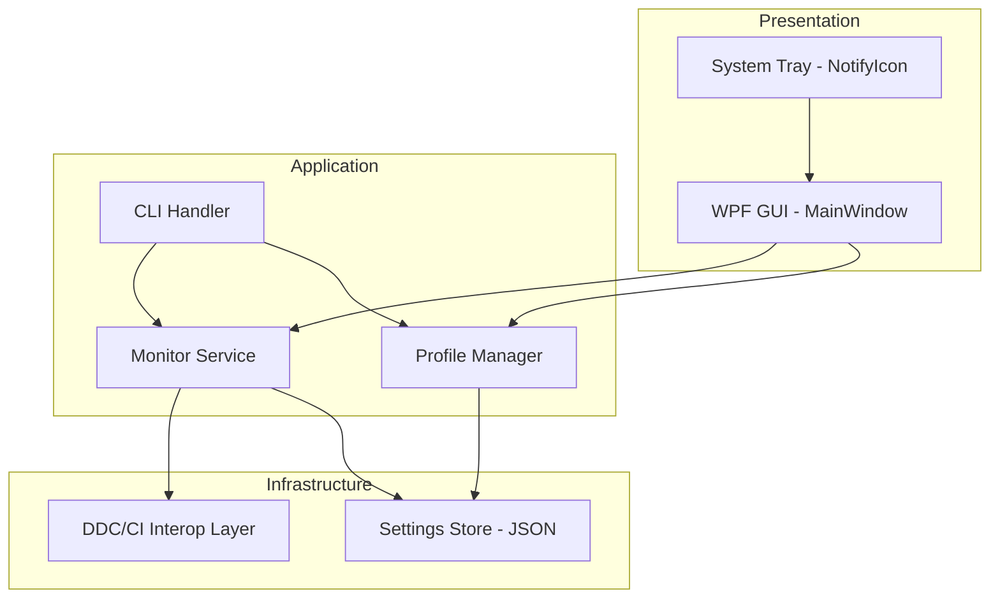
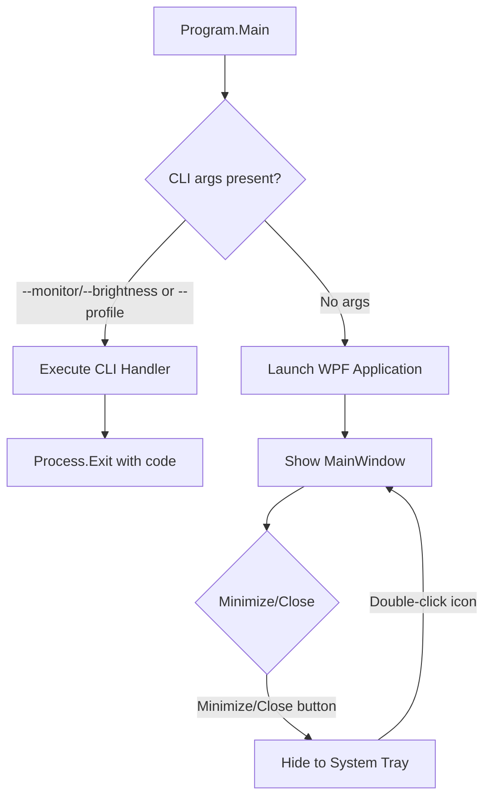

# Design Document: Monitor Brightness Controller

## Overview

Monitor Brightness Controller is a Windows 11 desktop application that provides both GUI and CLI interfaces for controlling external monitor brightness via the DDC/CI protocol. The application is built with C# / .NET 8 / WPF and communicates with monitors using the Windows Low-Level Monitor Configuration API (`SetVCPFeature` / `GetVCPFeatureAndVCPFeatureReply`). It supports named brightness profiles, a system tray mode, and publishes as a single-file `win-x64` executable.

The design prioritizes:
- Clean separation between DDC/CI hardware interaction, business logic, and UI
- Testability of pure logic (validation, profile management, CLI parsing) via property-based testing
- Robust error handling for unreliable DDC/CI communication
- Minimal external dependencies

## Architecture



The architecture follows a layered approach:

1. **Presentation Layer** – WPF window with per-monitor controls, system tray icon via `H.NotifyIcon.Wpf`
2. **Application Layer** – Business logic for monitor enumeration, brightness control orchestration, profile management, CLI argument parsing
3. **Infrastructure Layer** – P/Invoke wrapper for Windows Monitor Configuration APIs, JSON file I/O for settings persistence

### Entry Point Flow



## Components and Interfaces

### 1. DDC/CI Interop Layer (`MonitorInterop`)

Wraps the Win32 Low-Level Monitor Configuration API via P/Invoke.

**Key Win32 Functions:**
- `EnumDisplayMonitors` – Enumerate logical monitors
- `GetNumberOfPhysicalMonitorsFromHMONITOR` – Get count of physical monitors per HMONITOR
- `GetPhysicalMonitorsFromHMONITOR` – Retrieve physical monitor handles and description strings
- `GetVCPFeatureAndVCPFeatureReply` – Read current brightness (VCP code `0x10`)
- `SetVCPFeature` – Set brightness (VCP code `0x10`)
- `DestroyPhysicalMonitors` – Release physical monitor handles

**Interface:**
```csharp
public interface IMonitorInterop
{
    IReadOnlyList<PhysicalMonitorInfo> EnumerateMonitors();
    Result<int> GetBrightness(IntPtr physicalMonitorHandle);
    Result<Unit> SetBrightness(IntPtr physicalMonitorHandle, int value);
    void ReleaseMonitors(IEnumerable<IntPtr> handles);
}
```

**Design decisions:**
- VCP code `0x10` is the MCCS standard code for "Luminance" (brightness)
- Device path from `EnumDisplayDevices` with `EDD_GET_DEVICE_INTERFACE_NAME` provides deterministic ordering
- EDID monitor name is retrieved from the `PHYSICAL_MONITOR.szPhysicalMonitorDescription` field returned by `GetPhysicalMonitorsFromHMONITOR`
- All P/Invoke calls are isolated behind the interface for testability

### 2. Monitor Service (`MonitorService`)

Orchestrates monitor detection, state tracking, and brightness operations.

```csharp
public interface IMonitorService
{
    IReadOnlyList<MonitorState> DetectMonitors();
    Result<Unit> SetBrightness(int monitorIndex, int brightnessValue);
    Result<int> GetBrightness(int monitorIndex);
    MonitorState? FindMonitor(string identifier); // by index or name
}
```

**Responsibilities:**
- Enumerates monitors, assigns stable `MonitorIndex` based on sorted device paths
- Maintains in-memory `MonitorState` for each detected monitor
- Validates brightness values (0–100) before passing to interop layer
- Translates monitor identifiers (index or name) to the correct handle

### 3. Profile Manager (`ProfileManager`)

Manages named brightness profiles and persistence.

```csharp
public interface IProfileManager
{
    IReadOnlyList<Profile> GetAllProfiles();
    Result<Profile> GetProfile(string name); // case-insensitive
    Result<Unit> CreateProfile(string name, IReadOnlyDictionary<string, int> monitorBrightnessMap);
    Result<Unit> UpdateProfile(string name, IReadOnlyDictionary<string, int> monitorBrightnessMap);
    Result<Unit> DeleteProfile(string name);
    Result<Unit> ApplyProfile(string name, IMonitorService monitorService);
}
```

**Constraints:**
- Profile names: 1–64 characters, `[a-zA-Z0-9_-]`
- Maximum 50 profiles
- Case-insensitive name matching for lookup and uniqueness
- Monitors in profiles are identified by device path for stability across reboots

### 4. Settings Store (`SettingsStore`)

Handles JSON serialization/deserialization of application state.

```csharp
public interface ISettingsStore
{
    AppSettings Load();
    Result<Unit> Save(AppSettings settings);
}
```

**File location:** `%LOCALAPPDATA%\MonitorBrightnessController\settings.json`

### 5. CLI Handler (`CliHandler`)

Parses command-line arguments and executes the appropriate operations.

```csharp
public interface ICliHandler
{
    int Execute(string[] args);
}
```

**Supported argument patterns:**
- `--monitor <id> --brightness <value>` (repeatable)
- `--profile <name>`

### 6. GUI Components

- **MainWindow** – WPF window containing a `ListView`/`ItemsControl` of `MonitorControlGroup` items
- **MonitorControlGroup** – UserControl with label, slider (0–100), text input, and validation error display
- **ProfilePanel** – UI for creating, editing, and deleting profiles
- **SystemTrayManager** – Integrates `H.NotifyIcon.Wpf` for tray icon, context menu, and window show/hide

## Data Models

### MonitorState
```csharp
public record MonitorState
{
    public int MonitorIndex { get; init; }
    public string MonitorName { get; init; }
    public string DevicePath { get; init; }
    public IntPtr PhysicalHandle { get; init; }
    public int? CurrentBrightness { get; init; } // null = unknown
    public bool IsControllable { get; init; }
    public string? ErrorMessage { get; init; }
}
```

### Profile
```csharp
public record Profile
{
    public string Name { get; init; }
    public IReadOnlyDictionary<string, int> MonitorBrightnessMap { get; init; }
    // Key = device path, Value = brightness 0-100
}
```

### AppSettings
```csharp
public record AppSettings
{
    public List<Profile> Profiles { get; init; } = new();
    public bool AutoApplyOnStartup { get; init; } = false;
    public string? LastAppliedProfileName { get; init; }
}
```

### Result Type
```csharp
public readonly struct Result<T>
{
    public bool IsSuccess { get; }
    public T Value { get; }
    public string? Error { get; }

    public static Result<T> Success(T value) => new(true, value, null);
    public static Result<T> Failure(string error) => new(false, default!, error);
}
```

### Settings JSON Schema
```json
{
  "profiles": [
    {
      "name": "focus",
      "monitorBrightnessMap": {
        "\\\\?\\DISPLAY#DEL41AB#5&...": 40,
        "\\\\?\\DISPLAY#GSM59AB#7&...": 60
      }
    }
  ],
  "autoApplyOnStartup": false,
  "lastAppliedProfileName": "focus"
}
```

## Correctness Properties

*A property is a characteristic or behavior that should hold true across all valid executions of a system — essentially, a formal statement about what the system should do. Properties serve as the bridge between human-readable specifications and machine-verifiable correctness guarantees.*

### Property 1: Deterministic Monitor Index Assignment

*For any* set of monitors with distinct device paths, sorting by device path and assigning indices starting at 1 SHALL always produce the same index assignment for the same set of device paths, regardless of the order in which monitors are enumerated.

**Validates: Requirements 1.1**

### Property 2: Monitor Name Fallback

*For any* monitor with an index N, if the EDID-reported name is null, empty, or consists only of whitespace, the resolved display name SHALL equal the string "Monitor N".

**Validates: Requirements 1.2**

### Property 3: DDC/CI Support Filtering

*For any* list of enumerated monitors with varying DDC/CI support flags, the controllable monitor list SHALL contain exactly those monitors where DDC/CI support is true, and no others.

**Validates: Requirements 1.3**

### Property 4: Bidirectional Brightness Control Sync

*For any* valid brightness integer value V in [0, 100], setting the brightness via slider SHALL result in the text input displaying V, and committing the value V via text input SHALL result in the slider position being V.

**Validates: Requirements 2.4, 2.5**

### Property 5: Brightness Value Validation

*For any* string input that is not a representation of an integer in the range [0, 100], the brightness validation function SHALL reject the input and report it as invalid.

**Validates: Requirements 2.7, 3.5**

### Property 6: Case-Insensitive Monitor Identifier Resolution

*For any* monitor with a name M and any case-variant string S where `S.ToLowerInvariant() == M.ToLowerInvariant()`, resolving identifier S SHALL return the same monitor as resolving identifier M.

**Validates: Requirements 3.2**

### Property 7: Multi-Pair CLI Argument Parsing

*For any* sequence of N valid `--monitor <id> --brightness <value>` pairs (where N ≥ 1), parsing the argument array SHALL produce exactly N command objects, each preserving the original identifier and brightness value in order.

**Validates: Requirements 3.3**

### Property 8: Partial Failure Attempts All Monitors

*For any* set of N monitor-brightness commands where a subset F fails and the complement S succeeds, the system SHALL attempt all N operations, successfully apply brightness to all monitors in S, and report errors for all monitors in F.

**Validates: Requirements 3.7**

### Property 9: Profile Count Limit

*For any* settings store containing 50 profiles, attempting to create an additional profile SHALL be rejected, and the total number of stored profiles SHALL remain at 50.

**Validates: Requirements 4.2**

### Property 10: Profile Name Validation

*For any* string, the profile name validation function SHALL accept it if and only if it has length between 1 and 64 (inclusive) and consists solely of characters matching `[a-zA-Z0-9_-]`.

**Validates: Requirements 4.3**

### Property 11: Profile Application Skips Disconnected Monitors

*For any* profile mapping N monitors to brightness values, where a subset C of those monitors is currently connected and the complement D is disconnected, applying the profile SHALL set brightness on all monitors in C, skip all monitors in D, and succeed (exit code 0) as long as C is non-empty.

**Validates: Requirements 4.5**

### Property 12: Case-Insensitive Profile Name Uniqueness

*For any* existing profile with name P and any string Q where `P.ToLowerInvariant() == Q.ToLowerInvariant()`, attempting to create a new profile with name Q SHALL be rejected as a duplicate.

**Validates: Requirements 4.7**

### Property 13: Settings Serialization Round-Trip

*For any* valid `AppSettings` object, serializing it to JSON and then deserializing the resulting JSON SHALL produce an `AppSettings` object equal to the original.

**Validates: Requirements 5.1**

### Property 14: Last Applied Profile Tracking

*For any* valid profile name P, after successfully applying profile P, the settings store SHALL contain P as the `lastAppliedProfileName`.

**Validates: Requirements 5.5**

## Error Handling

### DDC/CI Communication Errors

| Scenario | Behavior |
|----------|----------|
| `GetVCPFeatureAndVCPFeatureReply` returns `false` | Mark monitor as `CurrentBrightness = null`, set `IsControllable = false`, display "unknown" in GUI |
| `SetVCPFeature` returns `false` | Return `Result.Failure` with monitor identifier, revert GUI to last known value, write stderr in CLI mode |
| Monitor handle becomes invalid (disconnected) | Remove from active list on next enumeration, log warning |
| `EnumDisplayMonitors` returns zero monitors | Display "no controllable monitors" message in GUI, exit code 1 in CLI with `--monitor` args |

### Settings Store Errors

| Scenario | Behavior |
|----------|----------|
| Settings file missing | Create new file with default `AppSettings` |
| Settings file corrupted (invalid JSON) | Log warning, create new file with defaults, do not crash |
| Settings file locked by another process | Retry once after 100ms delay, then report error to user |
| Disk full / write permission denied | Display error in GUI, return failure result, do not crash |

### CLI Argument Errors

| Scenario | Exit Code | Output |
|----------|-----------|--------|
| Unknown argument | 1 | Usage help to stderr |
| Missing `--brightness` after `--monitor` | 1 | "Missing --brightness value for monitor <id>" to stderr |
| Invalid brightness value | 1 | "Invalid brightness value '<val>': must be integer 0-100" to stderr |
| Monitor not found | 1 | "Monitor '<id>' not found" to stderr |
| Profile not found | 1 | "Profile '<name>' not found" to stderr |
| Mixed success/failure | 1 | Individual error per failed monitor to stderr |

### Profile Errors

| Scenario | Behavior |
|----------|----------|
| Profile name invalid (chars/length) | Reject with validation message in GUI |
| Duplicate profile name (case-insensitive) | Reject creation with "name already in use" message |
| Profile count at maximum (50) | Reject creation with "maximum profiles reached" message |
| All mapped monitors disconnected | Exit code 1 with "no mapped monitors available" to stderr |

## Testing Strategy

### Dual Testing Approach

This feature uses both example-based unit tests and property-based tests for comprehensive coverage.

**Property-Based Testing Library:** [FsCheck](https://fscheck.github.io/FsCheck/) (via `FsCheck.Xunit` NuGet package)
- Mature .NET PBT library with excellent C# support
- Integrates with xUnit test runner
- Supports custom generators and arbitraries for domain types

**Unit Testing Framework:** xUnit with FluentAssertions

### Property-Based Tests

Each property test SHALL:
- Run a minimum of **100 iterations** per property
- Reference the corresponding design property via tag comment
- Use custom Arbitrary instances for domain types (`MonitorState`, `Profile`, `AppSettings`)

| Test | Design Property | What's Generated |
|------|----------------|-----------------|
| `IndexAssignment_IsDeterministic` | Property 1 | Random lists of device path strings |
| `MonitorName_FallsBackCorrectly` | Property 2 | Random indices + nullable/empty/valid strings |
| `DdcFilter_ExcludesUnsupported` | Property 3 | Lists of (devicePath, supportsDdc) tuples |
| `BrightnessSync_IsBidirectional` | Property 4 | Random integers [0,100] |
| `BrightnessValidation_RejectsInvalid` | Property 5 | Random strings (non-numeric, negative, >100, floats) |
| `MonitorLookup_IsCaseInsensitive` | Property 6 | Random monitor names with case variants |
| `CliParsing_PreservesAllPairs` | Property 7 | Random N in [1,10], random identifiers and values |
| `PartialFailure_AttemptsAll` | Property 8 | Random sets with success/failure flags |
| `ProfileCount_EnforcesLimit` | Property 9 | Pre-filled 50 profiles + new profile attempt |
| `ProfileName_ValidatesCorrectly` | Property 10 | Random strings of varying length and charset |
| `ProfileApply_SkipsDisconnected` | Property 11 | Random profiles + random subset of connected monitors |
| `ProfileName_UniqueCaseInsensitive` | Property 12 | Existing names + case variants |
| `Settings_RoundTrips` | Property 13 | Random `AppSettings` objects |
| `LastProfile_TrackedOnApply` | Property 14 | Random valid profile names |

Tag format for each test:
```csharp
// Feature: monitor-brightness-controller, Property 1: Deterministic Monitor Index Assignment
```

### Unit Tests (Example-Based)

| Area | Tests |
|------|-------|
| Monitor detection | Empty list returns informational state; failed brightness read → "unknown" state |
| GUI behavior | DDC failure reverts to last value; no monitors shows message |
| CLI execution | Successful single-monitor set; profile not found → exit 1 |
| System tray | Minimize hides to tray; close button hides to tray; exit saves state |
| Startup | Auto-apply disabled reads without changing; missing settings creates defaults |
| Build | Single-file publish produces one .exe (smoke test) |

### Integration Tests

| Test | What's Verified |
|------|----------------|
| `SetBrightness_EndToEnd` | Full path from MonitorService through interop (requires real monitor) |
| `ProfileApply_EndToEnd` | Profile loaded from disk, brightness applied to mock monitors |
| `CLI_EndToEnd` | Process launched with args, verify exit code and stderr |
| `Settings_Persistence` | Write settings, restart, verify loaded correctly |

### Test Configuration

```xml
<PackageReference Include="xunit" Version="2.9.0" />
<PackageReference Include="FsCheck.Xunit" Version="2.16.6" />
<PackageReference Include="FluentAssertions" Version="7.0.0" />
<PackageReference Include="NSubstitute" Version="5.1.0" />
```

All property-based tests configured with:
```csharp
[Property(MaxTest = 100)]
```

