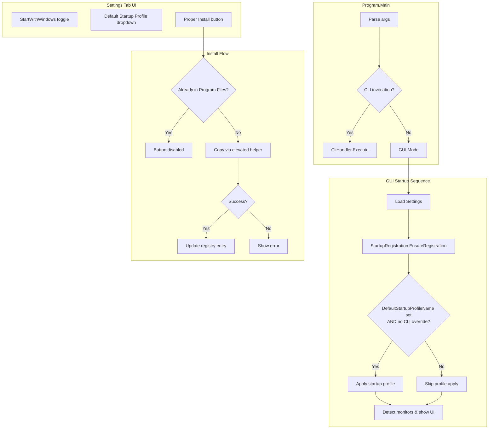

# Design Document: Startup and Install Enhancements

## Overview

This design extends the Monitor Brightness Controller with three interrelated capabilities:

1. **Auto-Start with Windows** — Reliable registration in the current-user Run registry key, with path self-healing on startup to handle moves/updates.
2. **Default Startup Profile** — A user-configurable profile that is automatically applied when the application launches in GUI mode (unless overridden by CLI arguments).
3. **Proper Install to Program Files** — A one-click button that copies the running executable to `%ProgramFiles%\MonitorBrightnessController\`, elevating via UAC as needed, and updates the autostart registry entry to reference the installed path.

These features share a common concern: ensuring the registry autostart path stays consistent with wherever the executable actually lives. The design addresses this by making path reconciliation a first-class startup step and by having the installer update the registry entry immediately after a successful copy.

### Design Decisions

| Decision | Rationale |
|----------|-----------|
| Refactor `StartupRegistration` from static to instance-based with `Result<Unit>` returns | Enables testability via interface injection and proper error reporting per Req 1.5/1.6 |
| Keep installer logic in a separate `ApplicationInstaller` class | Separates UAC/file-copy concerns from registry concerns; installer can be tested with mocked file system |
| Use an elevated helper process for file copy (not in-proc elevation) | WPF apps cannot re-elevate mid-process; launching a helper with `runas` verb is the standard pattern |
| Add `DefaultStartupProfileName` to `AppSettings` directly | Maintains the single-file settings approach; no schema migration needed (null = not set) |
| Integrate startup profile logic into the existing `StartupCoordinator` | Keeps all startup decision logic in one testable place |

## Architecture



## Components and Interfaces

### 1. `IStartupRegistration` (new interface)

Replaces the current static `StartupRegistration` class to enable dependency injection and testing.

```csharp
public interface IStartupRegistration
{
    /// <summary>
    /// Registers or unregisters the application for startup with Windows.
    /// </summary>
    Result<Unit> SetStartWithWindows(bool enable);

    /// <summary>
    /// Checks whether the app is registered and whether the path matches the current exe.
    /// If mismatched or missing (while enabled), re-registers with the correct path.
    /// </summary>
    Result<Unit> EnsureRegistration(bool startWithWindowsEnabled);

    /// <summary>
    /// Updates the registry entry to point to a specific executable path (used by installer).
    /// </summary>
    Result<Unit> UpdateRegisteredPath(string newExePath);

    /// <summary>
    /// Returns true if the registry entry currently exists.
    /// </summary>
    bool IsRegistered();
}
```

### 2. `StartupRegistration` (refactored)

Implements `IStartupRegistration`. Key changes from current implementation:
- Returns `Result<Unit>` instead of void (enables error reporting per Req 1.5, 1.6)
- `EnsureRegistration` performs case-insensitive path comparison and self-heals (Req 1.4, 5.1, 5.2)
- Validates `Environment.ProcessPath` before writing (Req 1.6)

### 3. `ApplicationInstaller` (new class)

```csharp
public interface IApplicationInstaller
{
    /// <summary>
    /// Determines whether the current process is running from the install directory.
    /// </summary>
    bool IsInstalledInProgramFiles();

    /// <summary>
    /// Copies the current executable to Program Files using UAC elevation.
    /// Returns the installed path on success.
    /// </summary>
    Result<string> InstallToProgamFiles();
}
```

Implementation details:
- Target: `%ProgramFiles%\MonitorBrightnessController\MonitorBrightnessController.exe`
- Uses `Process.Start` with `runas` verb to launch an elevated file copy command
- Creates the target directory if it doesn't exist
- Overwrites existing file at destination (Req 4.2)

### 4. `StartupCoordinator` (extended)

The existing `StartupCoordinator` is extended to:
- Call `EnsureRegistration` at startup when `StartWithWindows` is true (Req 1.4, 5.1, 5.2, 5.4)
- Check `DefaultStartupProfileName` instead of (or in addition to) `AutoApplyOnStartup` + `LastAppliedProfileName`
- Skip startup profile if CLI args contain `--monitor` or `--profile` (Req 2.5)
- Handle missing profile gracefully with a warning (Req 2.6)
- Handle disconnected monitors gracefully (Req 2.7)
- Update `LastAppliedProfileName` on successful apply (Req 2.8)

The `Decide` method signature extends to accept whether CLI override is active:

```csharp
public static StartupDecision Decide(
    AppSettings settings,
    IReadOnlyList<string> existingProfileNames,
    bool isCliOverride)
```

### 5. `MainWindowViewModel` (extended)

New bindable properties:
- `DefaultStartupProfileName` — bound to the dropdown selection
- `AvailableProfilesForStartup` — `ObservableCollection<string>` with "None" as first entry
- `IsProperlyInstalled` — drives button enabled state
- `InstallStatusText` — label text when installed
- `ProperInstallCommand` — ICommand for the install button

### 6. Settings Tab XAML additions

- **Default Startup Profile dropdown**: ComboBox bound to `AvailableProfilesForStartup` with selection bound to `DefaultStartupProfileName`
- **Proper Install button**: Enabled when `!IsProperlyInstalled`, shows status label when installed

## Data Models

### `AppSettings` (extended)

```csharp
public record AppSettings
{
    // ... existing properties ...

    /// <summary>
    /// Name of the profile to apply automatically on GUI startup, or null for none.
    /// </summary>
    public string? DefaultStartupProfileName { get; init; }
}
```

This is a backward-compatible addition. Existing settings files that lack this property will deserialize to `null` (no startup profile), preserving current behavior.

### Registry Data

| Key | Value Name | Value Data |
|-----|-----------|------------|
| `HKCU\SOFTWARE\Microsoft\Windows\CurrentVersion\Run` | `MonitorBrightnessController` | `"C:\Program Files\MonitorBrightnessController\MonitorBrightnessController.exe"` |

The path is always quoted to handle spaces. Case-insensitive comparison is used for path matching.

### Install Directory Structure

```
%ProgramFiles%\MonitorBrightnessController\
└── MonitorBrightnessController.exe
```


## Correctness Properties

*A property is a characteristic or behavior that should hold true across all valid executions of a system — essentially, a formal statement about what the system should do. Properties serve as the bridge between human-readable specifications and machine-verifiable correctness guarantees.*

### Property 1: Registration path quoting

*For any* valid Windows file path used as the executable location, calling `SetStartWithWindows(true)` SHALL write the path to the registry wrapped in double quotes (i.e., the stored value equals `"<path>"`).

**Validates: Requirements 1.1**

### Property 2: EnsureRegistration reconciliation

*For any* combination of (current executable path, existing registry value or absence thereof, StartWithWindows enabled/disabled), `EnsureRegistration` SHALL: do nothing when StartWithWindows is disabled; create the quoted current path when the entry is missing and StartWithWindows is enabled; update to the quoted current path when the entry differs case-insensitively; and leave the entry unchanged when it already matches case-insensitively.

**Validates: Requirements 1.4, 5.1, 5.2, 5.4**

### Property 3: Settings round-trip preserves DefaultStartupProfileName

*For any* valid `AppSettings` instance (including `DefaultStartupProfileName` being null or any valid profile name string), serializing to JSON and deserializing back SHALL produce an equivalent `AppSettings` with the same `DefaultStartupProfileName` value.

**Validates: Requirements 2.1**

### Property 4: Startup decision correctness

*For any* combination of (DefaultStartupProfileName value, list of existing profile names, CLI override flag), `StartupCoordinator.Decide` SHALL: skip profile application when CLI override is true regardless of other inputs; apply the named profile when it exists in the profile list and CLI override is false; and produce a "missing profile" decision with notice containing the profile name when the named profile does not exist in the profile list and CLI override is false.

**Validates: Requirements 2.4, 2.5, 2.6**

### Property 5: Startup profile dropdown list construction

*For any* list of profile names from the settings store, the `AvailableProfilesForStartup` collection SHALL contain "None" as its first element followed by all profile names in the same order they appear in the store, with total length equal to profile count plus one.

**Validates: Requirements 3.1**

### Property 6: Startup profile dropdown selection resolution

*For any* `DefaultStartupProfileName` value that is either null or does not match any name in the current profile list (case-insensitive), the effective selected value in the dropdown SHALL resolve to "None".

**Validates: Requirements 3.2**

### Property 7: Default profile cleanup on deletion

*For any* profile that is currently set as the `DefaultStartupProfileName`, when that profile is deleted, the `DefaultStartupProfileName` setting SHALL become null.

**Validates: Requirements 3.5**

### Property 8: Install directory detection

*For any* Windows file path, `IsInstalledInProgramFiles` SHALL return true if and only if the path matches `%ProgramFiles%\MonitorBrightnessController\MonitorBrightnessController.exe` using case-insensitive, path-normalized comparison.

**Validates: Requirements 4.1, 4.9**

## Error Handling

| Scenario | Behavior | User Feedback |
|----------|----------|---------------|
| Registry key cannot be opened for writing (Req 1.5) | Return `Result<Unit>.Failure(...)` | Settings toggle remains unchanged; error logged |
| Executable path is null/empty (Req 1.6) | Return `Result<Unit>.Failure(...)` | No registry write; error logged |
| DefaultStartupProfileName references non-existent profile (Req 2.6) | Log warning, continue startup | Startup notice in GUI with missing profile name |
| Startup profile apply fails (monitors disconnected) (Req 2.7) | Log failure details, continue startup | Startup notice with unavailable monitor info |
| Persisting DefaultStartupProfileName fails (Req 2.9, 3.6) | Return failure result | Error message dialog; dropdown reverts to previous value |
| UAC elevation denied (Req 4.6) | Abort install | "Install cancelled" message; no changes made |
| File copy fails (Req 4.7) | Abort install | Error message with failure details; no changes made |
| Install directory creation fails | Abort install | Error message; no changes made |

### Error Propagation Strategy

All error-prone operations return `Result<Unit>` or `Result<string>` rather than throwing exceptions. This matches the existing project convention (see `SettingsStore.Save`, `ProfileManager.ApplyProfile`). The UI layer inspects `IsSuccess` and surfaces `Error` via message boxes or status labels.

## Testing Strategy

### Unit Tests (xUnit + NSubstitute + FluentAssertions)

Focus areas:
- `StartupRegistration.SetStartWithWindows` — mock `IRegistryKey` wrapper to verify correct registry calls
- `StartupRegistration.EnsureRegistration` — verify all branches (missing, mismatch, match, disabled)
- `ApplicationInstaller.IsInstalledInProgramFiles` — various path inputs
- `StartupCoordinator.Decide` — all decision branches with edge cases
- ViewModel `DefaultStartupProfileName` setter — verify persistence triggered
- ViewModel dropdown state after profile create/delete

### Property-Based Tests (FsCheck.Xunit)

The project already uses **FsCheck.Xunit 2.16.6** for property-based testing. Each property test runs a minimum of 100 iterations.

Properties to implement:
1. **Property 1** — Generate random valid Windows paths → verify quoted format in mock registry
2. **Property 2** — Generate (path, registryValue, enabled) triples → verify EnsureRegistration outcome
3. **Property 3** — Generate AppSettings with random DefaultStartupProfileName → round-trip through JSON
4. **Property 4** — Generate (profileName, profileList, cliOverride) → verify Decide outcome
5. **Property 5** — Generate random profile name lists → verify dropdown construction
6. **Property 6** — Generate invalid/null profile names → verify "None" selection
7. **Property 7** — Generate profile name as default, delete it → verify null
8. **Property 8** — Generate random file paths → verify IsInstalledInProgramFiles matches expected

Each test is tagged with: `Feature: startup-and-install-enhancements, Property {N}: {title}`

### Integration Tests

- Full install flow with a temp directory standing in for Program Files
- Registry read/write round-trip against a test registry key
- Startup coordinator end-to-end with mocked services

### Test Configuration

```csharp
// FsCheck property configuration
[Property(MaxTest = 100, Arbitrary = new[] { typeof(WindowsPathArbitrary) })]
```

Custom `Arbitrary` generators will be needed for:
- Valid Windows file paths (avoiding invalid chars, reasonable length)
- Valid profile names (1–64 chars, `[a-zA-Z0-9_-]`)
- AppSettings instances with random but valid field values
