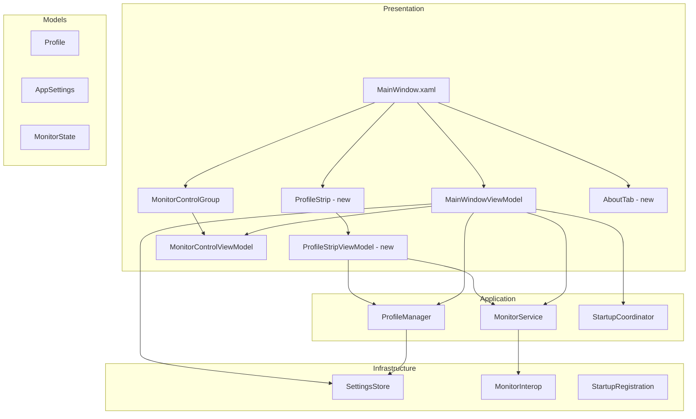

# Design Document: UI Consolidation

## Overview

This feature restructures the Monitor Brightness Controller UI from a 4-tab layout (Monitors, Profiles, Settings, Help) to a streamlined 3-tab layout (Monitors, Settings, About). The key changes are:

1. **Profile management moves inline** — The Profiles tab is removed and its controls are consolidated into a compact horizontal "Profile Strip" on the Monitors tab.
2. **Slider synchronization** — Sliders preview profile values on selection and sync with hardware on load/deselection.
3. **Settings tab gains** — Create Shortcut functionality and a unified Startup Profile section move to the Settings tab.
4. **About tab replaces Help** — A lightweight About tab shows version, build date, and repository link (all derived from assembly metadata).
5. **Tab order simplified** — Three tabs in logical order: Monitors → Settings → About.

The architecture remains MVVM with code-behind for WPF-specific interactions (dialogs, COM shortcut creation). No new dependencies are introduced.

## Architecture



### Key Architectural Decisions

1. **ProfileStripViewModel replaces ProfilePanelViewModel** — The new ViewModel drives a compact horizontal strip rather than a vertical list-based panel. It adds slider synchronization on profile selection (previewing values) which the old panel did not have.

2. **Slider sync lives in MainWindowViewModel** — The main VM already owns the `Monitors` collection. It will expose a method to apply profile values to monitor VMs (preview) and a method to restore hardware values (deselect). ProfileStripViewModel signals the main VM via callbacks.

3. **Settings tab sections consolidated in MainWindow.xaml** — The Startup Profile section and Create Shortcut section are both rendered directly in the Settings tab XAML with bindings to MainWindowViewModel properties.

4. **About tab is pure XAML** — No ViewModel needed. Version and build date are sourced from assembly attributes at compile time, injected via `AssemblyInformationalVersionAttribute` and a custom build-date attribute or MSBuild-generated constant.

5. **No new NuGet packages** — Shortcut creation continues using `WScript.Shell` COM (already in codebase). Assembly metadata read uses reflection on the entry assembly.

## Components and Interfaces

### New Components

#### `ProfileStrip` (UserControl + code-behind)
- **File**: `Presentation/ProfileStrip.xaml` + `Presentation/ProfileStrip.xaml.cs`
- **Purpose**: Compact horizontal profile management strip on Monitors tab
- **Layout**: Single-row horizontal: `[ComboBox: profiles] [Apply] [Update] [Delete] [Save As New]`
- **Code-behind responsibilities**: Confirmation dialog for delete, popup input dialog for Save As New, shortcut creation removed (moved to Settings)

#### `ProfileStripViewModel`
- **File**: `Presentation/ProfileStripViewModel.cs`
- **Purpose**: Drives the profile strip ComboBox and button states, coordinates with MainWindowViewModel for slider sync
- **Key members**:
  - `ObservableCollection<string> ProfileNames` — sorted case-insensitive alphabetical
  - `string? SelectedProfileName` — current selection (null = no selection)
  - `bool CanApply` / `bool CanUpdate` / `bool CanDelete` — bound to button IsEnabled
  - `RelayCommand ApplyCommand`
  - `RelayCommand UpdateCommand`
  - `RelayCommand DeleteCommand`
  - `Action<string?>? OnProfileSelected` — callback to MainWindowViewModel for slider preview
  - `Func<Dictionary<string, int>>? CaptureBrightnessMap` — captures current slider brightness values
  - `Func<Dictionary<string, int>>? CaptureGammaMap` — captures current slider gamma values

#### `AboutTab` (inline XAML in MainWindow or separate UserControl)
- **Purpose**: Displays version, build date, repository hyperlink
- **Design**: Static content bound to assembly metadata read at startup
- **No ViewModel required** — values are constants at runtime

### Modified Components

#### `MainWindowViewModel` — Changes
- **Remove**: `AvailableProfilesForStartup`, `SelectedStartupProfile`, `RefreshStartupProfileDropdown()`, `NotifyProfileDeleted()`, `NotifyProfileCreated()` (replace with new startup profile logic)
- **Add**:
  - `string? SelectedStartupProfileName` — persisted, supports "Last Used" (stored as empty string or special sentinel)
  - `bool AutoApplyOnStartup` — existing, now controls enabling/disabling the startup dropdown
  - `ObservableCollection<string> StartupProfileOptions` — "Last Used" + alphabetical profile names
  - `ObservableCollection<string> ShortcutProfileOptions` — all profile names (no "Last Used")
  - `string? SelectedShortcutProfile` — selected profile for shortcut creation
  - `bool CanCreateShortcut` — enabled when a shortcut profile is selected
  - `RelayCommand CreateShortcutCommand`
  - `string? ShortcutStatusMessage`
  - `string AppVersion` — from assembly
  - `string BuildDate` — from assembly
  - `void PreviewProfile(string? profileName)` — updates monitor VMs to show profile values
  - `void RestoreHardwareValues()` — reads hardware and updates monitor VMs
  - `void RefreshAllProfileDropdowns()` — refreshes all profile-related dropdowns after create/delete

#### `MainWindow.xaml` — Changes
- **Remove**: Profiles tab, Help tab
- **Add**: Profile strip below monitor list in Monitors tab, About tab (3rd tab)
- **Modify**: Settings tab to include Startup Profile section and Create Shortcut section
- **Tab order**: Monitors → Settings → About

#### `MainWindow.xaml.cs` — Changes
- **Remove**: `WireProfilePanel()`, `PopulateHelp()`
- **Add**: `WireProfileStrip()` — wires the new ProfileStripViewModel with callbacks
- **Move**: Shortcut creation logic (COM interop) stays in code-behind but moves to a method called by the CreateShortcutCommand

#### `StartupCoordinator` — Changes
- **Modify `Decide()`** to handle the "Last Used" semantics:
  - When `DefaultStartupProfileName` is `null` and `AutoApplyOnStartup` is true → apply `LastAppliedProfileName` (this is the "Last Used" behavior)
  - When `DefaultStartupProfileName` is a specific name → apply that profile directly
  - This is largely how it already works; the main change is the UI representation of "Last Used" as an explicit dropdown option rather than being implicit

#### `AppSettings` — Changes
- No structural changes needed. The existing `DefaultStartupProfileName` (null = "Last Used" / auto-apply last) and `AutoApplyOnStartup` fields already support the new UI semantics.
  - `null` DefaultStartupProfileName + `AutoApplyOnStartup=true` → "Last Used" behavior
  - specific name in DefaultStartupProfileName + `AutoApplyOnStartup=true` → apply that profile
  - `AutoApplyOnStartup=false` → no auto-apply regardless of dropdown selection

### Removed Components
- `ProfilePanel.xaml` + `ProfilePanel.xaml.cs` — replaced by ProfileStrip
- `ProfilePanelViewModel.cs` — replaced by ProfileStripViewModel

## Data Models

### Existing Models (no changes needed)

```csharp
public record Profile
{
    public string Name { get; init; }
    public IReadOnlyDictionary<string, int> MonitorBrightnessMap { get; init; }
    public IReadOnlyDictionary<string, int>? MonitorGammaMap { get; init; }
}

public record AppSettings
{
    public List<Profile> Profiles { get; init; }
    public bool AutoApplyOnStartup { get; init; }
    public bool MinimizeToTray { get; init; }
    public string? LastAppliedProfileName { get; init; }
    public bool SmoothTransition { get; init; }
    public int TransitionDurationMs { get; init; }
    public bool StartWithWindows { get; init; }
    public bool RefreshOnFocus { get; init; }
    public string? DefaultStartupProfileName { get; init; }
}

public record MonitorState
{
    public int MonitorIndex { get; init; }
    public string MonitorName { get; init; }
    public string DevicePath { get; init; }
    public IntPtr PhysicalHandle { get; init; }
    public int? CurrentBrightness { get; init; }
    public int? CurrentGamma { get; init; }
    public bool IsControllable { get; init; }
    public string? ErrorMessage { get; init; }
}
```

### Assembly Metadata for About Tab

The build version is already defined in the `.csproj`:
```xml
<Version>1.2.0</Version>
```

For the build date, add an MSBuild-generated source file:

```xml
<!-- In .csproj -->
<PropertyGroup>
    <BuildDate>$([System.DateTime]::UtcNow.ToString("yyyy-MM-dd"))</BuildDate>
</PropertyGroup>

<ItemGroup>
    <AssemblyAttribute Include="System.Reflection.AssemblyMetadataAttribute">
        <_Parameter1>BuildDate</_Parameter1>
        <_Parameter2>$(BuildDate)</_Parameter2>
    </AssemblyAttribute>
</ItemGroup>
```

This embeds `[assembly: AssemblyMetadata("BuildDate", "2025-01-15")]` at compile time, readable via:
```csharp
Assembly.GetExecutingAssembly()
    .GetCustomAttributes<AssemblyMetadataAttribute>()
    .FirstOrDefault(a => a.Key == "BuildDate")?.Value;
```

### Startup Profile Dropdown Mapping

| Dropdown Display | Stored `DefaultStartupProfileName` | Behavior on Startup |
|---|---|---|
| "Last Used" | `null` | Apply `LastAppliedProfileName` if non-null |
| "MyProfile" | `"MyProfile"` | Apply "MyProfile" directly |

The `AutoApplyOnStartup` checkbox gates whether any startup application happens at all.

## Correctness Properties

*A property is a characteristic or behavior that should hold true across all valid executions of a system — essentially, a formal statement about what the system should do. Properties serve as the bridge between human-readable specifications and machine-verifiable correctness guarantees.*

### Property 1: Startup slider sync without applicable profile

*For any* set of detected monitors with hardware-reported brightness and gamma values, when the application starts without a valid startup profile to apply (no DefaultStartupProfileName configured, or auto-apply disabled, or startup profile missing/failed), each monitor's brightness slider SHALL equal its hardware-reported brightness and each gamma slider SHALL equal its hardware-reported gamma.

**Validates: Requirements 1.1, 1.3**

### Property 2: Startup slider sync with profile application

*For any* startup profile and set of detected monitors, when the application starts with a valid startup profile, each monitor that appears in the profile's brightness/gamma maps SHALL have its slider set to the profile-defined value, and each monitor NOT in the profile's maps SHALL have its slider set to the hardware-reported value.

**Validates: Requirements 1.2**

### Property 3: Hardware read failure defaults to midpoint

*For any* monitor whose DDC/CI hardware read fails during startup synchronization, the brightness slider and gamma slider SHALL display the value 50, and the monitor's panel SHALL show an error indicator.

**Validates: Requirements 1.4**

### Property 4: Profile selection updates mapped monitors and retains unmapped

*For any* profile selection and set of connected monitors, each monitor present in the profile's brightness map SHALL have its brightness slider updated to the profile value, each monitor present in the gamma map SHALL have its gamma slider updated, each monitor NOT in the brightness map SHALL retain its current brightness slider value, and each monitor NOT in the gamma map (including legacy profiles with null gamma map) SHALL retain its current gamma slider value.

**Validates: Requirements 2.1, 2.2, 2.3**

### Property 5: Clearing profile selection restores hardware values

*For any* monitor configuration, when the profile dropdown selection is cleared, each monitor whose hardware value can be read SHALL have its sliders restored to the hardware-reported values. Monitors whose hardware read fails SHALL retain their last displayed value.

**Validates: Requirements 2.4, 2.5**

### Property 6: Profile dropdown alphabetical ordering

*For any* set of saved profile names, the profile dropdown SHALL list them in case-insensitive alphabetical order. This applies to both the Profile Strip dropdown on the Monitors tab and the Create Shortcut dropdown on the Settings tab.

**Validates: Requirements 3.2, 5.2**

### Property 7: Profile apply sends correct values to mapped monitors

*For any* saved profile and set of connected monitors, applying the profile SHALL call SetBrightness with the profile's brightness value for each connected monitor in the brightness map, and SetGamma with the profile's gamma value for each connected monitor in the gamma map. Monitors not in the connected set SHALL be skipped.

**Validates: Requirements 3.4**

### Property 8: Profile name validation and creation persistence

*For any* candidate profile name, creation SHALL succeed if and only if the name is 1–64 characters of `[a-zA-Z0-9_-]`, does not duplicate an existing name (case-insensitive), and the profile count is below 50. On success, the new profile SHALL appear in the store with brightness and gamma maps matching the current slider values.

**Validates: Requirements 3.11, 3.12**

### Property 9: Profile deletion removes from store and dropdown

*For any* saved profile, deleting it SHALL remove it from the settings store's profile list. After deletion, the profile name SHALL no longer appear in any profile dropdown.

**Validates: Requirements 3.8**

### Property 10: Startup dropdown lists "Last Used" first then alphabetical profiles

*For any* set of saved profile names, the Startup Profile dropdown SHALL list "Last Used" as the first item followed by all saved profile names in case-insensitive alphabetical order.

**Validates: Requirements 6.5**

### Property 11: Startup profile application correctness

*For any* startup profile configuration where AutoApplyOnStartup is enabled, if "Last Used" is selected (DefaultStartupProfileName is null) and LastAppliedProfileName refers to an existing profile, that profile SHALL be applied. If a specific profile name is selected and exists, that profile SHALL be applied.

**Validates: Requirements 6.6, 6.7**

### Property 12: Startup profile selection persistence

*For any* change to the Startup Profile dropdown selection, the new selection SHALL be persisted to the DefaultStartupProfileName setting immediately (null for "Last Used", profile name for a specific profile).

**Validates: Requirements 6.8**

### Property 13: Deleted startup profile resets to "Last Used"

*For any* profile that is currently selected as the startup profile, if that profile is deleted, the Startup Profile dropdown SHALL reset its selection to "Last Used" and persist `DefaultStartupProfileName = null`.

**Validates: Requirements 6.9**

### Property 14: Shortcut arguments correctly formed

*For any* valid profile name, the created shortcut SHALL have its arguments set to `--profile {name}`, its target set to the application executable path, and its working directory set to the executable's parent folder.

**Validates: Requirements 5.4**

### Property 15: Profile update overwrites with current values

*For any* existing profile, updating it SHALL overwrite its MonitorBrightnessMap and MonitorGammaMap with the current slider values for all connected monitors, and the updated profile SHALL be persisted to the store.

**Validates: Requirements 3.6**

## Error Handling

### Startup Errors
| Scenario | Behavior |
|---|---|
| Startup profile not found | Skip application, reset to "Last Used", show startup notice banner |
| Profile apply partially fails (some monitors unreachable) | Show warning notice, sliders fall back to hardware values for failed monitors |
| DDC/CI read fails for a monitor | Show slider at 50, display error indicator on monitor panel |
| Settings file corrupt/missing | Use defaults (existing `SettingsStore.Load()` behavior) |

### Profile Operations
| Scenario | Behavior |
|---|---|
| Apply with no connected mapped monitors | Show error message "No mapped monitors available" |
| Delete confirmation cancelled | No-op, profile retained |
| Save As New with invalid name | Show validation error in dialog, keep dialog open |
| Save As New at 50-profile limit | Show error message "Profile limit reached" |
| Settings persistence failure | Show error, revert UI to previous state |

### Shortcut Creation
| Scenario | Behavior |
|---|---|
| WScript.Shell COM unavailable | Show error message describing the failure |
| File system write failure | Show error, no partial file left (COM handles atomicity) |
| User cancels save dialog | No-op |

### Hardware Communication
| Scenario | Behavior |
|---|---|
| Hardware read fails on profile deselection | Retain last displayed slider value |
| DDC/CI write fails during apply | Collect errors, report after all monitors attempted |

## Testing Strategy

### Property-Based Tests (FsCheck for .NET)

The project will use **FsCheck** (the standard .NET property-based testing library) integrated with xUnit via `FsCheck.Xunit`. Each property test runs a minimum of 100 iterations.

**Configuration**:
```csharp
[Property(MaxTest = 100)]
```

**Tag format**: `Feature: ui-consolidation, Property {N}: {title}`

Property tests focus on the pure logic:
- StartupCoordinator.Decide (Properties 1, 2, 3, 11)
- Profile selection slider sync logic (Properties 4, 5)
- Profile name sorting (Properties 6, 10)
- ProfileManager validation and CRUD (Properties 7, 8, 9, 15)
- Startup profile persistence logic (Properties 12, 13)
- Shortcut argument formatting (Property 14)

### Unit Tests (xUnit)

Example-based tests for UI-specific behaviors:
- Tab structure: exactly 3 tabs with correct headers (Requirements 4.1, 4.2, 4.3, 8.1, 8.2, 8.3)
- Button enabled/disabled states (Requirements 3.14, 5.5)
- Checkbox toggles dropdown enabled state (Requirements 6.3, 6.4)
- Profile strip layout presence (Requirement 3.1)
- About tab content structure (Requirements 7.1, 7.3, 7.4)
- Empty profile state (Requirement 3.3)
- Default selection states (Requirement 5.2)

Edge case tests:
- Maximum profile count rejection (Requirement 3.13)
- Hardware read failure on deselection retains value (Requirement 2.5)
- "Last Used" with null LastAppliedProfileName (Requirement 6.10)
- Missing startup profile resets and persists (Requirement 6.11)
- Apply with zero connected mapped monitors (Requirement 3.5)
- Shortcut creation failure cleanup (Requirement 5.7)

### Integration Tests

- Shortcut creation with real COM object (Requirement 5.3)
- About tab hyperlink navigation (Requirement 7.2)
- Assembly metadata read (Requirements 7.5, 7.6)

### Test Project Structure

```
MonitorBrightnessController.Tests/
├── Properties/
│   ├── SliderSyncProperties.cs       (Properties 1-5)
│   ├── ProfileDropdownProperties.cs   (Properties 6, 10)
│   ├── ProfileCrudProperties.cs       (Properties 7, 8, 9, 15)
│   ├── StartupProfileProperties.cs    (Properties 11, 12, 13)
│   └── ShortcutProperties.cs          (Property 14)
├── Unit/
│   ├── TabStructureTests.cs
│   ├── ButtonStateTests.cs
│   ├── StartupProfileSectionTests.cs
│   └── AboutTabTests.cs
└── Integration/
    ├── ShortcutCreationTests.cs
    └── AssemblyMetadataTests.cs
```
