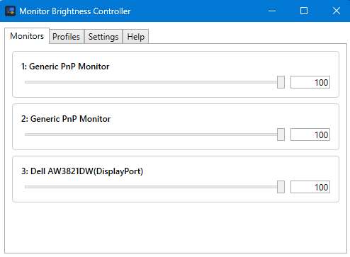
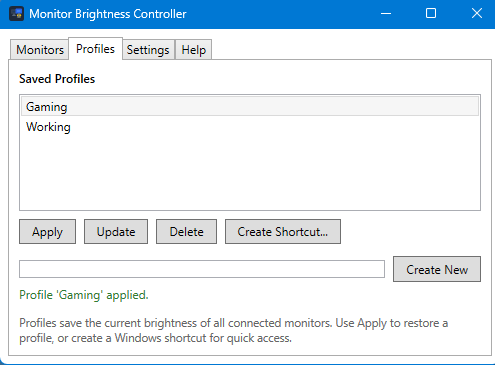
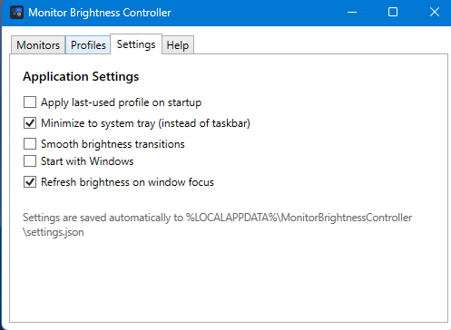

# Monitor Brightness Controller

A lightweight Windows 11 desktop application that controls external monitor brightness via DDC/CI. Provides a graphical interface with per-monitor sliders and a command-line interface for automation and keyboard shortcuts.

Built with C# / .NET 8 / WPF. Distributed as a single executable.



## Features

- **Per-monitor brightness control** — individual sliders for each DDC/CI-capable external monitor
- **Named profiles** — save, apply, update, and delete brightness presets (e.g. "Gaming", "Working")
- **CLI mode** — set brightness or apply profiles via command-line arguments (no GUI shown)
- **Windows shortcut creation** — one-click shortcut generation for any saved profile
- **System tray** — optional minimize-to-tray with double-click restore and context menu
- **Smooth transitions** — optional animated brightness fade between values
- **Start with Windows** — optional auto-launch on login
- **Auto-apply on startup** — optionally restore your last-used profile at launch
- **Refresh on focus** — re-reads hardware brightness when the window regains focus
- **Single-file exe** — one portable file, runs from any location

## Screenshots

| Monitors | Profiles | Settings |
|----------|----------|----------|
|  |  |  |

## Prerequisites

- Windows 11 (or Windows 10 with .NET 8)
- [.NET 8 Runtime](https://dotnet.microsoft.com/download/dotnet/8.0) (x64)
- External monitors with DDC/CI enabled (check your monitor's OSD menu)

## Installation

### Download

Download the latest `MonitorBrightnessController.exe` from [Releases](../../releases) and place it anywhere on your system.

### Build from source

```bash
git clone https://github.com/dlightman/monitor-brightness-controller.git
cd monitor-brightness-controller
dotnet publish MonitorBrightnessController/MonitorBrightnessController.csproj -c Release
```

The single executable is produced at:
```
MonitorBrightnessController/bin/Release/net8.0-windows/win-x64/publish/MonitorBrightnessController.exe
```

## Usage

### GUI Mode

Launch without arguments:

```
MonitorBrightnessController.exe
```

- **Monitors tab** — drag sliders or type values (0–100) to adjust each monitor
- **Profiles tab** — create/apply/update/delete brightness presets, or generate Windows shortcuts
- **Settings tab** — configure application behavior
- **Help tab** — built-in documentation

### CLI Mode

Pass arguments to control brightness without showing the GUI:

```bash
# Set brightness for specific monitors
MonitorBrightnessController.exe --monitor 1 --brightness 70
MonitorBrightnessController.exe --monitor "Dell AW3821DW" --brightness 40

# Multiple monitors in one command
MonitorBrightnessController.exe --monitor 1 --brightness 100 --monitor 2 --brightness 50 --monitor 3 --brightness 80

# Apply a saved profile
MonitorBrightnessController.exe --profile Gaming
```

**Monitor identifiers**: use the index number (1, 2, 3...) or the monitor name (case-insensitive).

**Exit codes**: `0` = success, `1` = one or more operations failed (details on stderr).

### Keyboard Shortcuts

The easiest approach:
1. Go to the **Profiles** tab
2. Select a profile and click **Create Shortcut...**
3. Save the `.lnk` file (e.g. to Desktop)
4. Right-click the shortcut → Properties → **Shortcut key** → assign a hotkey (e.g. Ctrl+Alt+G)

Manual approach:
```
Target: C:\path\to\MonitorBrightnessController.exe --profile Gaming
```

> **Note**: Do not wrap arguments in quotes. If the exe path has spaces, quote only the path:
> ```
> "C:\My Programs\MonitorBrightnessController.exe" --profile Working
> ```

## Settings

All settings are in the **Settings** tab and saved automatically to:
```
%LOCALAPPDATA%\MonitorBrightnessController\settings.json
```

| Setting | Default | Description |
|---------|---------|-------------|
| Apply last-used profile on startup | Off | Restores your most recent profile when the app launches |
| Minimize to system tray | On | Hides to tray on minimize/close instead of taskbar |
| Smooth brightness transitions | Off | Fades brightness gradually instead of jumping |
| Start with Windows | Off | Auto-launches the app on login |
| Refresh brightness on window focus | On | Re-reads hardware values when the window is activated |

## System Tray (when enabled)

- Minimize or close → hides to system tray
- Double-click tray icon → restore window
- Right-click tray icon → Restore or Exit
- Exit saves settings and terminates the process

## Troubleshooting

**No monitors detected**
- Enable DDC/CI in your monitor's OSD settings (often under System → DDC/CI)
- Laptop built-in displays do not support DDC/CI — only external monitors
- Some KVM switches or docking stations block DDC/CI signals

**CLI shortcut not changing brightness**
- Ensure arguments are not wrapped in a single quoted string
- Test from a command prompt: `MonitorBrightnessController.exe --monitor 1 --brightness 50`
- Verify the monitor index matches (run the GUI to see the assigned indices)

**System tray icon not showing**
- Check that "Minimize to system tray" is enabled in the Settings tab
- The tray icon only appears after you minimize or close the window

## Project Structure

```
├── MonitorBrightnessController/        # Main WPF application
│   ├── Application/                    # Business logic (MonitorService, ProfileManager, CliHandler)
│   ├── Infrastructure/                 # DDC/CI interop, settings persistence, startup registration
│   ├── Interfaces/                     # Service interfaces
│   ├── Models/                         # Data models (MonitorState, Profile, AppSettings, Result<T>)
│   ├── Presentation/                   # WPF views, view models, system tray
│   └── Assets/                         # Application icon
├── MonitorBrightnessController.Tests/  # xUnit + FsCheck property-based tests
├── tools/                              # Icon generation tool
├── docs/screenshots/                   # Application screenshots
└── MonitorBrightnessController.sln     # Solution file
```

## Development

```bash
# Build
dotnet build MonitorBrightnessController.sln

# Run tests (83 tests including 14 property-based tests with 100 iterations each)
dotnet test MonitorBrightnessController.sln

# Publish single-file exe
dotnet publish MonitorBrightnessController/MonitorBrightnessController.csproj -c Release
```

Requires only the .NET 8 SDK. No Visual Studio or additional tools needed.

## License

MIT License — see [LICENSE](LICENSE) for details.
